# Like / Profile / Follow

## 1. Like

> User는 여러 개의 게시글에 '좋아요' 표시를 할 수 있고, 게시글을 여러 명의 User에게 '좋아요' 를 받을 수 있다. 

<br>

### 1.1 모델 설정

#### [ articles Application ]

- models.py

  - `article.like_users`으로 User가 '좋아요' 누른 게시글을 알 수 있다. 

  - `related_name = 'like_articles'`

    - 현재 상황에서 `related_name` 옵션 설정은 필수
      - 만약, like_users 필드에 related_name을 쓰지 않으면, User 입장에서 article_set을 사용할 때 `user` 필드를 가져올지 `like_users`필드를 가져올지 인식하지 못한다.
      - related_name 설정과 함께 해당 필드는 article_set과 같은 방식으로 호출하지 못하고, `like_users` 방식으로 호출해야 된다.

  - `blank = True`

    - 최초 작성되는 글에는 좋아요가 없고, 글이 작성되더라도 좋아요를 받지 못할 수 있다.

    - `blank` 옵션을 부여해서 유효성 검사를 통과한다.

    - 실제 데이터베이스는 null이 들어가는게 아니라 빈 스트링(`' '`) 형태로 들어간다.

    ```python
    # Create your models here.
    class Article(models.Model):
        title = models.CharField(max_length=40)
        content = models.TextField()
    
        created_at = models.DateTimeField(auto_now_add=True)
        updated_at = models.DateTimeField(auto_now=True)
        user = models.ForeignKey(settings.AUTH_USER_MODEL, on_delete=models.CASCADE)
        # article.like_users
        like_users = models.ManyToManyField(settings.AUTH_USER_MODEL, related_name='like_articles', blank=True)
    
        # 객체 표시 형식 수정
        def __str__(self):
            return f'[{self.title}] {self.content}'
    ```

    

<br>

- migrate를 수행하고 sqlite3 를 확인한다.

  ```bash
  $ python manage.py makemigrations
  $ python manage.py migrate
  ```

  - 임의의 테이블 'article_like_user'가 생성되었다. 

    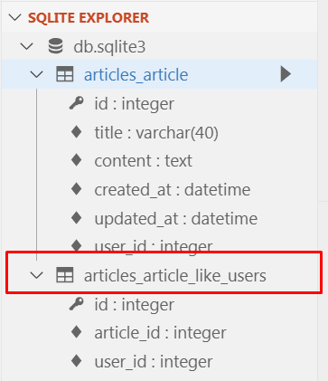


<br>

#### [ 사용가능한 ORM 기능 (명령어) ]

##### User

- `user.article_set.all()` : User 가 작성한 게시글 전부 가져오기 [ 1 : N ]

- `user.like_articles.all()` : User 가 좋아요 누른 게시글 전부 가져오기 [ M : N ]

##### Article

- `article.user ` : 게시글을 작성한 User 가져오기 [ 1 : N ]

- `article.like_users ` : 유저가 작성한 게시글 전부 가져오기 [ M  : N ]

<br>

### 1.2 View & URL

#### [ articles Application ]

##### exists() & filter()

- `exists()` : 최소한 하나의 레코드가 존재하는지의 여부만 말해준다.
- `filter()` : 특정한 조건에 맞는 레코드들을 가져온다.

<br>

##### get() vs filter()

- 데이터가 없는 경우 에러 여부
  - get은 <u>에러발생</u>, 중복되는 데이터가 없을때 사용 가능하다.
  - filter는 에러가 발생하지 않는다.

<br>

- views.py

  - : 로그인한 사용자만 '좋아요'를 누를 수 있도록 한다.

  - `user in article.like_users.all()`: 현재 게시글에 '좋아요'를 누른 사람의 목록

    - 현재 접속한 User가 있는 경우 
      - 좋아요 취소
      - User를 현재 게시글에 '좋아요'를 누른 사람의 목록에서 삭제한다.
    - 현재 접속한 User가 없는 경우 
      - 좋아요 
      - User를 현재 게시글에 '좋아요'를 누른 사람의 목록에 추가한다.

    ```python 
    # 좋아요 기능
    @login_required
    def like(request, article_pk):
        # 좋아요 누른 게시글 가져오기
        article = get_object_or_404(Article, pk=article_pk)
        # 현재 접속하고 있는 User
        user = request.user
        # 현재 게시글에 좋아요를 누른 사람의 목록에서
        # 현재 접속한 User가 있는 경우 -> 좋아요 취소
        # 현재 접속한 User가 없는 경우 -> 좋아요 
        if user in article.like_users.all():
            article.like_users.remove(user)
        else : 
            # article.like_users.add(user)
            article.like_users.add(user)
    
        return redirect('articles:index')
    ```

  <br>

- urls.py

  ```python 
  from django.urls import path
  from . import views
  
  app_name="articles"
  urlpatterns = [
      path('', views.index, name="index"),
      path('create/', views.create, name="create"),
      path('<int:article_pk>/',views.detail, name="detail"),
      path('<int:article_pk>/delete',views.delete, name="delete"),
      path('<int:article_pk>/update',views.update, name="update"),
      path('<int:article_pk>/comments',views.comments_create, name="comments_create"),
      path('<int:article_pk>/comments/<int:comment_pk>/delete',views.comments_delete, name="comments_delete"),
      path('<int:article_pk>/like/', views.like, name="like"),
  ]
  
  ```

<br>

### 1.3 Template

#### 1.3.1 Templat 분리 (_article.html)

- <u>모듈화한 템플릿</u>은 제목 앞에 **언더스코어(_)** 붙여주는것이 **코딩 컨벤션**!

  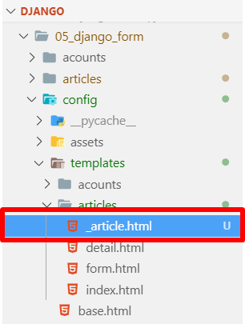

  <br>

- _article.html

  - Bootstrap Card 컴포넌트를 사용해서 예쁘게 꾸며보자!!!
    - Bootstrap 공식 홈페이지 -> Documentation -> [Cards](https://getbootstrap.com/docs/4.3/components/card/)

      ```django
      <div class="col-12 col-md-6 mb-3">
          <div class="card">
              <div class="card-body">
                  <h5 class="card-title">
                      글 제목: {{ article.title }}
                  </h5>
                  <p class="card-text">
                      <a href="">좋아요</a><br>
                      {{ article.like_users.all|length }}명이 이 글을 좋아합니다. <br>
                      생성시각: {{ article.created_at }}
                  </p>
                  <a href="" class="btn btn-primary">상세보기</a>
              </div>
          </div>
      </div> 
      ```

<br>

- index.html

  - `` : 모듈화 시켜둔 article 템플릿 가져오기

    ```django
    
    
      <h1>Articles</h1>
      <hr>
      <a href="">[NEW]</a>
      <hr>
      <div class="row">
        
          <!-- 모듈화 시켜둔 article 템플릿 가져오기 -->
          
          
      </div>
    
    
    
    
    ```

    <br>

- 실행 화면

  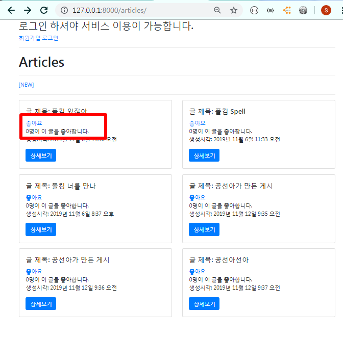

  <br>

#### 1.3.2 Font- Awesome 아이콘 적용 및 분기

> [Font- Awesome 홈페이지](https://fontawesome.com/) 들어가서 가입 후, 

<br>

- Kits로 들어가서 script 코드를 복사하여 base.html에 넣어준다.

  ```html
  <script src="https://kit.fontawesome.com/[kits코드번호].js" crossorigin="anonymous"></script>
  ```

  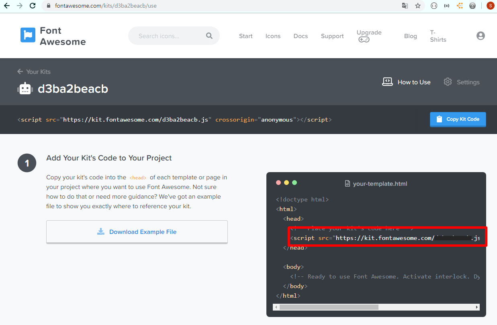

  - base.html

    ```django
    
    
    <!DOCTYPE html>
    <html lang="en">
    
    <head>
        .
        .
        .
      <!-- FontAwesome -->
      <script src="https://kit.fontawesome.com/[kits코드번호].js" crossorigin="anonymous"></script>
    </head>
    
    ```

    <br>

- 원하는 아이콘을 선택한뒤, 코드를 복사하여 사용한다.

  ```python 
  # 하트 모양 아이콘
  <i class="fas fa-heart"></i>
  ```

  - _articles.html

    ```django
    <div class="col-12 col-md-6 mb-3">
      <div class="card">
        <div class="card-body">
          <h5 class="card-title">
            글 제목: {{ article.title }}
          </h5>
          <p class="card-text">
            <a href="">
              <!-- 사용자가 좋아요 누른 상태 -> 꽉찬 하트 -->
              
                <i class="fas fa-heart"></i>
              <!-- 안 누른 상태 -> 빈 하트 -->
              
                <i class="far fa-heart"></i>
              
            </a><br>
            {{ article.like_users.all|length }}명이 이 글을 좋아합니다. <br>
            생성시각: {{ article.created_at }}
          </p>
          <a href="" class="btn btn-primary">상세보기</a>
        </div>
      </div>
    </div> 
    ```

- 실행 화면

  - '좋아요' 누르기 전

    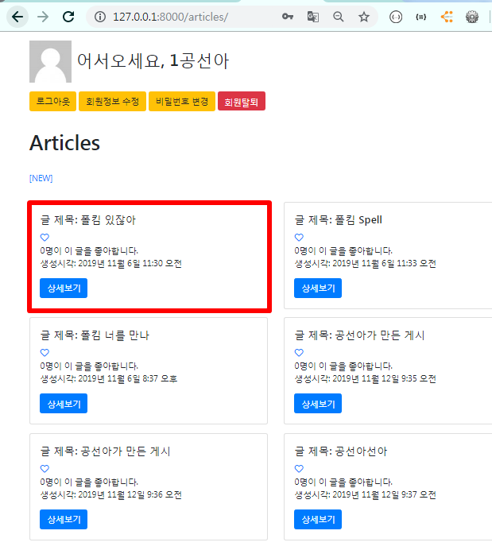

    <br>

  - '좋아요' 누른 후 

    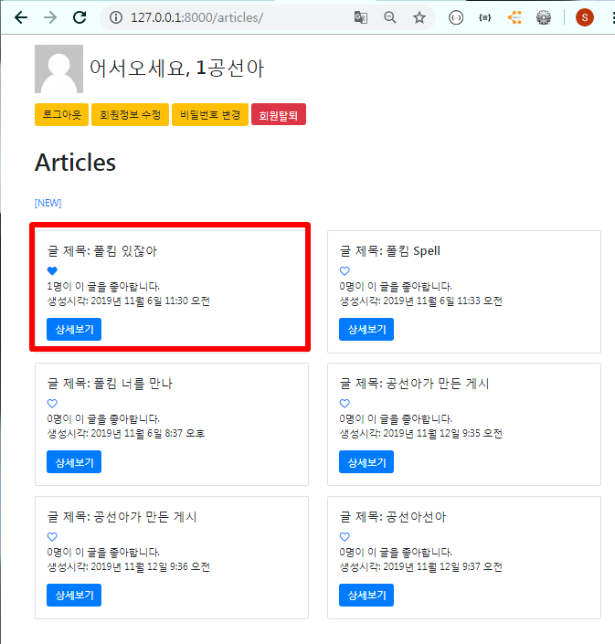

    <br>


## 2. Profile

> 로그인한 User는 '마이페이지' 버튼을 이용해 자신이 작성한 게시글과 댓글을 한눈에 볼 수 있다. 각 User 마다 프로필 페이지를 만들어주자.
>
> - User의 CRUD 로직 중 Read 로직에 해당한다.

<br>

### 2.1 View & URL

#### [ acounts Application ]

> User에 대한 CRUD 로직의 대부분을 acounts Application에서 구현했기 때문에, Profile 페이지 역시 acounts Application에 구현해보자.

<br>

- views.py

  - request로 들어오는 `username`으로 User에 대한 정보를 가져온다.

    ```python 
    from django.shortcuts import render, redirect, get_object_or_404
    from django.contrib.auth import get_user_model
    
    def profile(request, username):
        person = get_object_or_404(get_user_model(), username=username)
        context = {
            'person' : person,
        }
        return render(request, 'acounts/profile.html', context)
    ```

- urls.py

  - url 패턴에서 `str`을 사용하면 맨아래에 위치해서 마지막에 탐색되게 해야한다. 

    - 조건을 붙일경우에는 위치 상관 없다.

      ```python 
      from django.urls import path
      from . import views
      
      app_name="acounts"
      urlpatterns = [
          path('signup/', views.signup, name="signup"),
          path('login/', views.login, name="login"),
          path('logout/', views.logout, name="logout"),
          path('delete/', views.delete, name="delete"),
          path('update/', views.update, name="update"),
          path('password/', views.change_password, name="change_password"),
          path('<str:username>/', views.profile, name='profile'),
      ]
      
      ```


<br>

### 2.2 Template

> User가 작성한 게시글, 댓글을 볼 수 있는 profile.html을 만들어보자!

<br>

- base.html

  - 마이페이지로 이동하는 링크 생성

    ```django
    <a href="" class="btn btn-warning">마이페이지</a>
    ```

    ```django
    <body>
      <div class="container">
        
          .
          .
          .
        <a href="" class="btn btn-warning">마이페이지</a>
    
    ```

  <br>

- profile.html

  - `article.like_users.all|length` : 게시글에 '좋아요'를 누른 사람들의 수

  - `person.article_set.all` : User가 작성한 게시글 모두를 가져온다.

  - `person.comment_set.all` : User가 작성한 댓글 모두를 가져온다.

  - `coment.created_at|date:"SHORT_DATETIME_FORMAT"` : 날짜 표시 형식을 변형할 수 있다.

    ```django
    
    
    
    <h1 class="text-center mt-3">{{ person.username }}님의 Profile</h1>
    <hr>
    <h3 class="text-center mb-3">{{ person.username }}님이 작성한 게시글</h3>
    <div class="row">
      
      <div class="col-12 col-md-6 mb-3">
        <div class="card">
          <div class="card-body">
            <h5 class="card-title">
              글 제목: {{ article.title }}
            </h5>
            <p class="card-text">
              {{ article.like_users.all|length }}명이 이 글을 좋아합니다. <br>
              생성시각: {{ article.created_at }}
            </p>
            <a href="" class="btn btn-primary">상세보기</a>
          </div>
        </div>
      </div>
      
    </div>
    </div>
    <hr>
    <h3 class="text-center mb-3">{{ person.username }}님이 작성한 댓글</h3>
    <div class="container">
      <div class="row">
        
        <div class="col-12 col-md-6 mb-3">
          <div class="card">
            <div class="card-body">
              <h5 class="card-title">
                {{ coment.content }}
              </h5>
              <p class="card-text">
                작성시각: {{ coment.created_at|date:"SHORT_DATETIME_FORMAT" }}
              </p>
              <a href="" class="btn btn-primary">게시글 확인</a>
            </div>
          </div>
        </div>
        
      </div>
    </div>
     
    ```

  <br>

- 실행 화면

  - 로그인하면 '마이페이지' 버튼이 보인다. 

    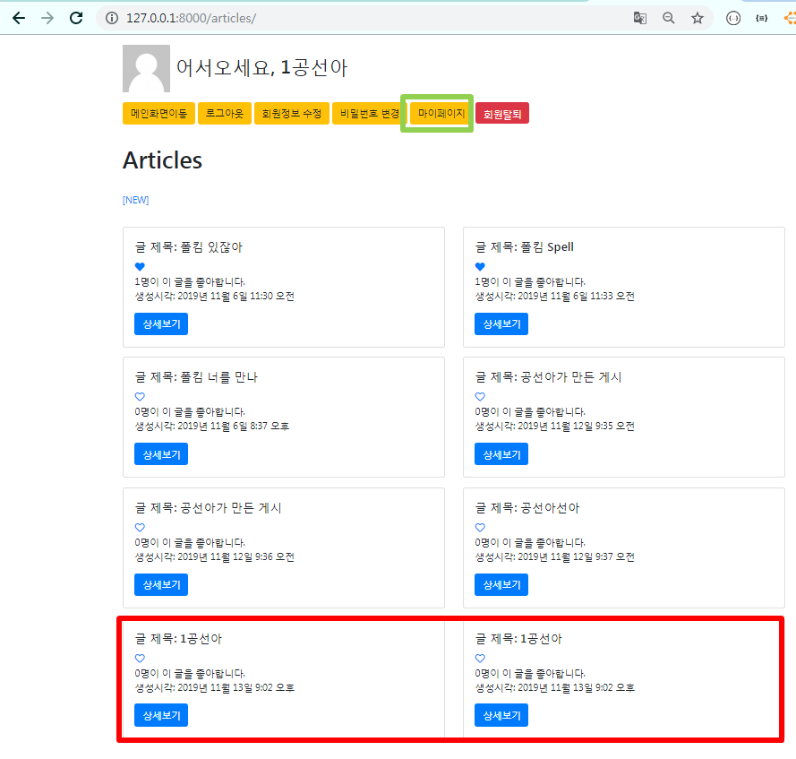

    <br>

  - 마이페이지

    - [1공선아]가 작성한 게시글과 댓글을 볼 수 있다.
      -  '상세보기' 또는 '게시글 확인' 버튼을 누르면, 해당 게시글의 상세정보를 볼 수 있다. 

    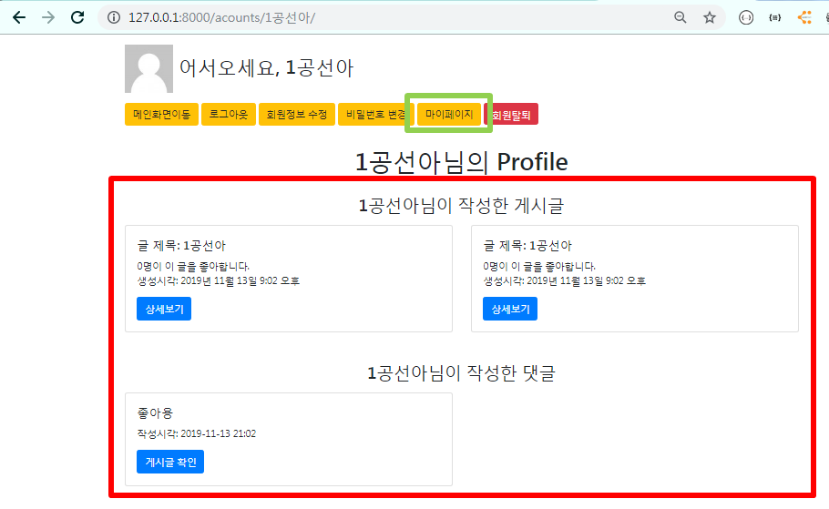

    <br>

### 2.3 Navigation Bar

> 상단에 메뉴 버튼들을 위해 Nav Bar를 만들어보자!

<br>

- nav bar 또한 모듈화한 템플릿으로 생성한다.

  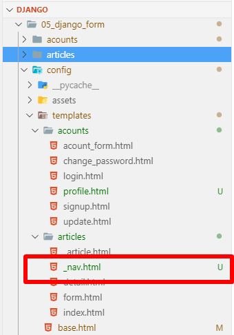

  <br>

- _nav.html 

  - base.html의 상단 메뉴 버튼을 생성한 코드들을 _nav.html에 작성하고 bootstrap으로 꾸며보자

    ```django
    
    <nav class="navbar navbar-expand-lg navbar-dark bg-dark">
      <a class="navbar-brand" href="">
        
        Hello, {{ user.username }}
      </a>
      <button class="navbar-toggler" type="button" data-toggle="collapse" data-target="#navbarNav" aria-controls="navbarNav" aria-expanded="false" aria-label="Toggle navigation">
        <span class="navbar-toggler-icon"></span>
      </button>
      <div class="collapse navbar-collapse" id="navbarNav">
        <ul class="navbar-nav">
          
            <li class="nav-item active">
              <a class="nav-link" href="">메인화면</a>
            </li>
            <li class="nav-item active">
              <a class="nav-link" href="">로그아웃</a>
            </li>
            <li class="nav-item active">
              <a class="nav-link" href="">마이페이지</a>
            </li>
            <li class="nav-item active">
              <a class="nav-link" href="">정보수정</a>
            </li>
            <li class="nav-item active">
              <a class="nav-link" href="">암호변경</a>
            </li>
            <form action="" method="POST" style="display: inline;">
              
              <input type="submit" value="회원탈퇴" class="btn btn-danger">
            </form>
          
            <li class="nav-item active">
              <a class="nav-link" href="">로그인</a>
            </li>
            <li class="nav-item active">
              <a class="nav-link" href="">회원가입</span></a>
            </li>
          
        </ul>
      </div>
    </nav> 
    ```

  <br>

- base.html

  - ``를 `<div class="container">`안으로 넣으면 nav bar가 화면 전체를 차지하지 않게 된다. 

    ```django
    
    <!DOCTYPE html>
    <html lang="en">
    
        <head>
            <meta charset="UTF-8">
            <meta name="viewport" content="width=device-width, initial-scale=1.0">
            <meta http-equiv="X-UA-Compatible" content="ie=edge">
            <title>Article</title>
            
            <!-- FontAwesome -->
            <script src="https://kit.fontawesome.com/d3ba2beacb.js" crossorigin="anonymous"></script>
        </head>
    
        <body>
    
            
            <div class="container">
                
                    
            </div>
    
            
        </body>
    
    </html>
    ```

<br>

- 실행 화면

  - 메인화면 nav bar

    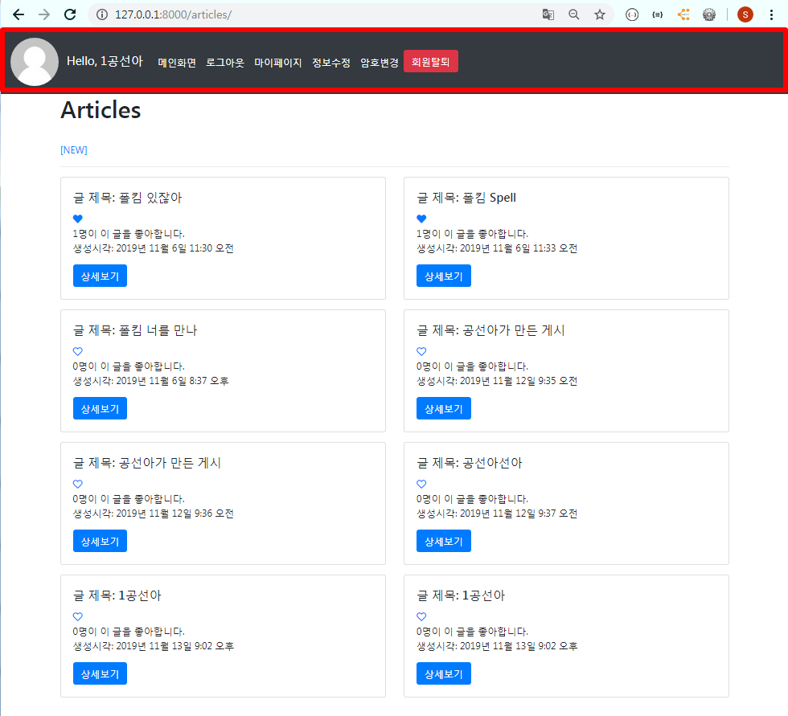

  <br>

  - 반응형으로 페이지의 크기를 작게하면 nav bar 의 모습이 바뀐다.

    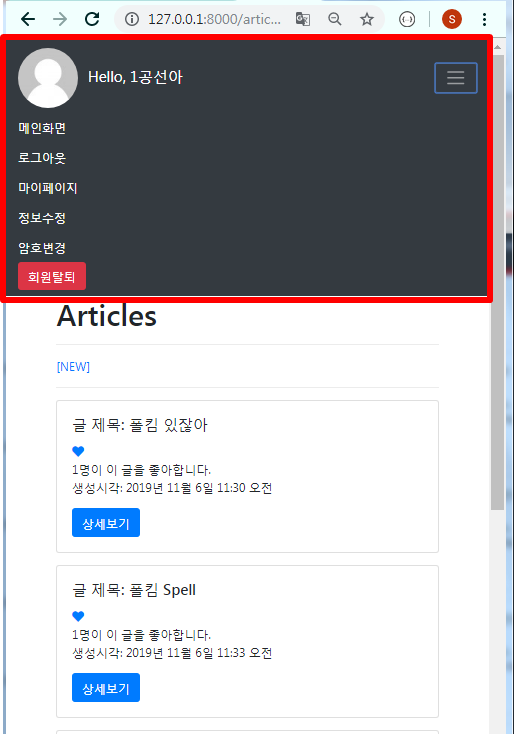 

<br>


