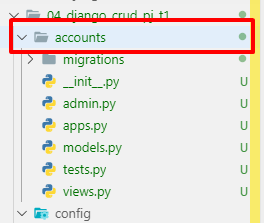

# 해피해킹 종합 프로젝트 #1

> django 심화 단계로 넘어가기 전, 기본을 확실하게 다지기 위해 CRUD 를 능숙하게 구현하는 것을 연습하자!
>
> [프로젝트 명세서](https://drive.google.com/drive/folders/1syodllw09WQF4JbpojT8UJqOotWesljG)

<br>


## 1. 프로젝트 생성

```
$ django-admin startproject config .
```


## 2. Applicatioin 생성 및 등록

```
$ python manage.py startapp movies
```


### 2.1 등록

- settings.py

  

  - python-extension 추가

    

  - 언어 설정

    

  - templates 설정

    - 'DIRS '에 `os.path.join(BASE_DIR, 'config', 'templates')`  작성하기

      


### 2.2 템플릿 상속 및 경로 Cutomizing

- templates 폴더 생성

  

- 상속 받아 사용할 base.html 을 생성한다.

  - base.html

    ```django
    <!DOCTYPE html>
    <html lang="en">
        <head>
            <meta charset="UTF-8">
            <meta name="viewport" content="width=device-width, initial-scale=1.0">
            <meta http-equiv="X-UA-Compatible" content="ie=edge">
            <title>Django CRUD</title>
            <!-- Bootstrap CSS -->
            <link rel="stylesheet" href="https://stackpath.bootstrapcdn.com/bootstrap/4.3.1/css/bootstrap.min.css" integrity="sha384-ggOyR0iXCbMQv3Xipma34MD+dH/1fQ784/j6cY/iJTQUOhcWr7x9JvoRxT2MZw1T" crossorigin="anonymous">
        </head>
        <body>
            <div class="container">
    
                
                
    
            </div>
            <!-- Bootstrap JS -->
            <script src="https://code.jquery.com/jquery-3.3.1.slim.min.js" integrity="sha384-q8i/X+965DzO0rT7abK41JStQIAqVgRVzpbzo5smXKp4YfRvH+8abtTE1Pi6jizo" crossorigin="anonymous"></script>
            <script src="https://cdnjs.cloudflare.com/ajax/libs/popper.js/1.14.7/umd/popper.min.js" integrity="sha384-UO2eT0CpHqdSJQ6hJty5KVphtPhzWj9WO1clHTMGa3JDZwrnQq4sF86dIHNDz0W1" crossorigin="anonymous"></script>
            <script src="https://stackpath.bootstrapcdn.com/bootstrap/4.3.1/js/bootstrap.min.js" integrity="sha384-JjSmVgyd0p3pXB1rRibZUAYoIIy6OrQ6VrjIEaFf/nJGzIxFDsf4x0xIM+B07jRM" crossorigin="anonymous"></script>
    
        </body>
    </html>
    ```

  <br>

### 2.3 Urls 로직 분리 정리

- movies Application 에 별도의 urls.py 생성

  

  - config/ urls.py

    ```python 
    from django.contrib import admin
    from django.urls import path, include
    from movies import views
    
    urlpatterns = [
        path('movies/', include('movies.urls')),
        path('admin/', admin.site.urls),
    ]
    ```

    <br>

  - movies/ urls.py

    ```python 
    from django.urls import path
    from . import views
    
    app_name='movies'
    urlpatterns = [
        path('', views.index, name='index'), # READ Logic - Index
    
    ]
    ```

    <br>


index 페이지

- views.py

  ```
  from django.shortcuts import render, redirect
  
  # Create your views here.
  def index(request):
      return render(request, 'movies/index.html')
  ```

- urls.py

  ```
  from django.urls import path
  from . import views
  
  app_name='movies'
  urlpatterns = [
      path('', views.index, name='index'), # READ Logic - Index
  
  ]
  ```

- index.html

  ```
  
  
  
  <h1>MOVIE</h1>
  
  ```

  


## 3. Model 등록

- models.py

  ```python 
  from django.db import models
  
  # Create your models here.
  class Movie(models.Model):
      title = models.CharField(max_length=50)
      title_en = models.CharField(max_length=60)
      audience = models.IntegerField()
      open_date = models.DateField()
      genre = models.CharField(max_length=50)
      watch_grade = models.CharField(max_length=10)
      score = models.FloatField()
      poster_url = models.TextField()
      description = models.TextField()
  
  ```

```bash
$ python manage.py makemigrations
```

- 실행 화면

  

  <br>


```bash
$ python manage.py showmigrations
```

- 실행 화면

  

  <br>


```bash
$ python manage.py migrate
$ python manage.py showmigrations
```

- 실행  후 확인

  

  <br>

- sqlite3로 확인

  

  <br>

  


<br>

## 4. 인스턴스 생성

- shell_plus로 인스턴스를 추가한다.

  ```bash
  $ python manage.py shell_plus
  ```

  ```python 
  In [4]: from movies.models import Movie
  ```

  - 영화 '글라스'

    ```python 
    In [6]: movie = Movie()
    
    In [7]: movie.title='글래스'
    
    In [8]: movie.title_en='Glass'
    
    In [9]: movie.audience='339707'
    
    In [10]: movie.open_date='2019-01-09'
    
    In [11]: movie.genre='드라마'
    
    In [12]: movie.watch_grade='15세이상관람가'
    
    In [13]: movie.score=7.69
    
    In [15]: movie.poster_url='https://movie-phinf.pstatic.net/20181227_126/1545900402100CiQHx_JPEG/movie_image.jpg'
    
    In [16]: movie.description='24개의 인격ㆍ강철 같은 신체ㆍ천재적 두뇌 통제불가한 24번째 인격 비스트를 깨운 케빈, 강철 같은 신체 능력을 지닌 의문
        ...: 의 남자 던, 천재적 두뇌를 지닌 미스터리한 설계자 미스터 글래스, 마침내 그들이 한 자리에 모이게 되고 이들의 존재가 세상에 드러나면서 예
        ...: 상치 못한 일이 벌어지는데...'
    ```

  - sqlite3 

    

    <br>


## 5. Seed Data

> [Seed Data](https://github.com/Sunaaaa/TIL/blob/master/Django/django_11_04_Seed_Data.md) 를 참고하여 테스트 데이터 추가하기!!

<br>


## 6. RESTful CRUD 

### 6.1 CREATE

- 새 영화 등록하기 (create)
- 댓글 생성하기 (detail)

### 6.2 READ

- 영화 목록 보여주기 (index)
- 영화 상세 보기 (detail)
- 댓글 보여주기 (detail)

### 6.3 UPDATE

- 영화 정보 수정하기 (update)

### 6.4. DELETE

- 영화 삭제하기 (detail)
- 댓글 삭제하기 (detail)


<br>

<br>

## [ pylint에 django기능 추가 ]

```bash
$ pip install pylint-django
```

<br>

- python  파일에 빨간 줄 혹은 파란 줄이 생기는 것을 방지한다.

```json
"python.linting.pylintArgs": [
    "--load-plugins=pylint_django",
    "--errors-only",
],
```


<br>


## 7. Authentication

### 7.1 accounts Application 생성 및 설정



