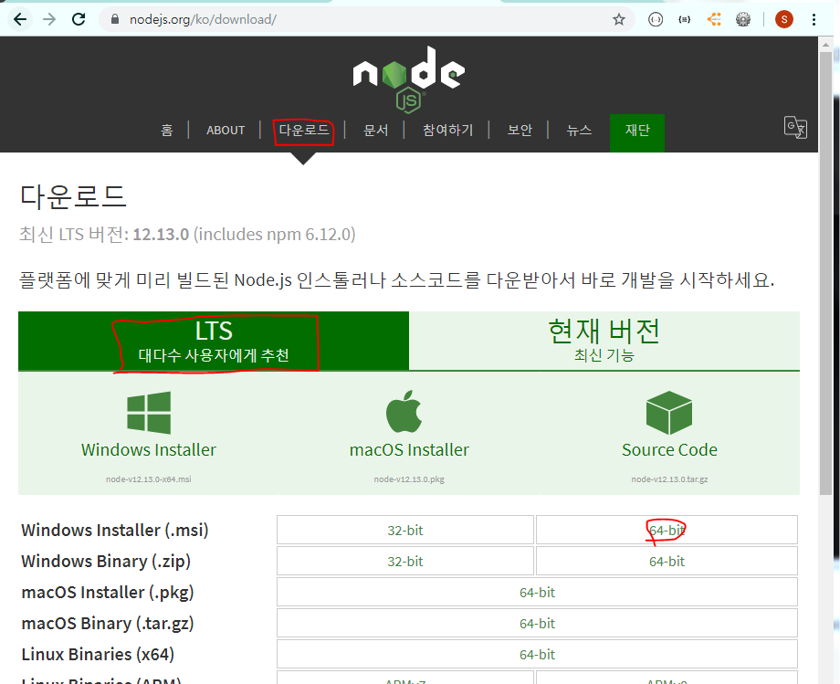
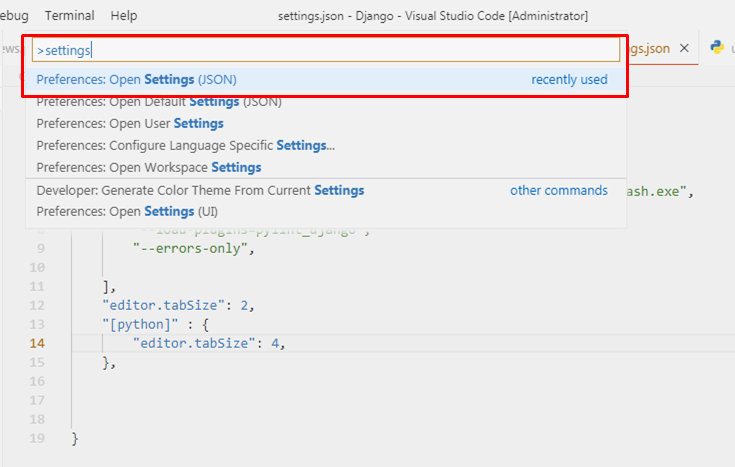
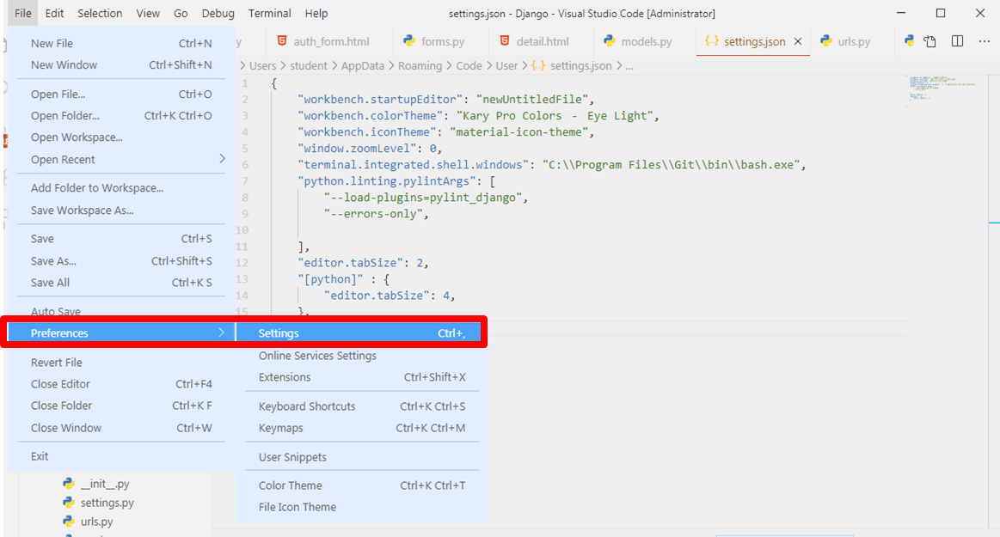
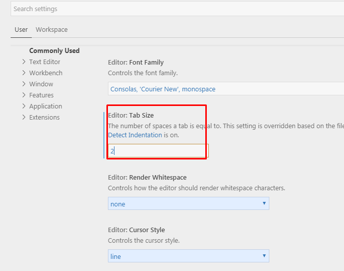
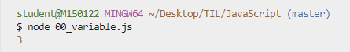
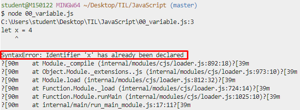
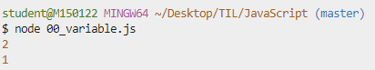
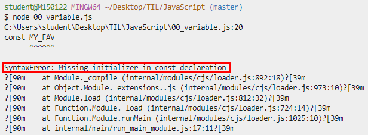

# JavaScript Syntax basics


## 0. 사전 준비 

> HTML로 뼈대를 잡고 CSS로 꾸미고, JavaScript로 활력을 불어 넣는다. 
>
> JavaScript로 서버까지 구축할 수 있도록 Node.js 등장!!
>
> - Node.js 발표와 동시에 JavaScript가 브라우저 종속적인 언어가 아닌 서버 구축까지 가능해지면서 Hot 한 언어로 급부상한다.
>
> - `Express.js` (서버), `React.js `(프론트), `Vue.js` (프론트) 등 JavaScript 기반의 수 많은 프레임워크, 라이브러리 들이 현대 웹 개발 트랜드를 주도라고 있다.

<br>

### 0.1 Node.js 설치

- node.js 공식 홈페이지에서 [다운로드](https://nodejs.org/ko/)
  - LTS Vercion (안정적)
  
  - Windows Installer (.ms) 64bit
  
    


<br>

- 설치 확인

  ```bash
  $ node -v
  v12.13.0
  ```


<br>

### 0.2 VS Code Python & JavaScript Indenting 설정

- settings.py

  

  <br>

  ```python 
  {
      .
      .
      
      "editor.tabSize": 2,
      "[python]" : {
          "editor.tabSize": 4,
      }, 
  
      .
      .
  
  }
  ```

  <br>

  

- VSCode 환경 설정

  

  <br>

  

  <br>


### 0.3 Naming Convention

#### lower Camel Case

- 단봉 낙타 표기법
- JavaScript의 기본 표기법


#### Upper Camel Case

- 쌍봉 낙타 표기번


#### snake_case


#### kebob-case


### 0.4 Extentions (추천)

- `auto close tag`
- `rainbow brackets`
- `indent-rainbow`

<br>


실행 방법

```bash
$ node [파일명]
```



## 1. Variable

### 1.1 let (변수)

- 값을 재할당 할 수 있는 변수를 선언하는 키워드

- 변수 선언은 한 번만 할 수 있다.

  ```javascript
  // let (변수)
  let x = 1
  let x = 4
  x = 3 // 재할당
  console.log(x)
  ```

  

  <br>

  - 그러나, 할당은 여러 번 할 수 있다. 

    ```javascript
    // let (변수)
    let x = 1
    x = 3 // 재할당 가능
    console.log(x)
    ```

    

    <br>

- 블록 유효 범위 (`Block Scope`) 를 갖는 지역 변수 

  ```javascript
  let x = 1
  if (x===1){
    // if문 만큼의 유효범위를 가지고 있다. 
    // 벗어나면 접근 불가능!
    let x = 2
    console.log(x)  // 2
  }
  console.log(x)    // 1
  ```

  

<br>


### 1.2 const (상수) 

- 값이 변하지 않는 상수를 선언하는 키워드 
  - 상수의 값은 재할당을 통해 바뀔 수 없고, 재선언도 **불가능**하다.
- `let`과 동일하게 `Block Scope`를 갖는다.
- 가능한 모든 선언에서 상수를 써야 한다.
  - 일단 상수를 사용하고, 값이 바뀌는게 자연스러운 상황이면 그때 변수(`let`)로 바꿔서 사용하는 것을 권장한다.


- 초기값을 생략하면 **ERROR** 발생

  

  <br>


