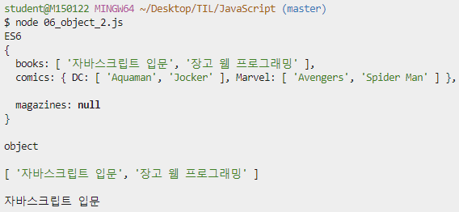
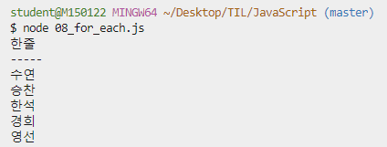

# JavaScript Syntax basics


## 0. 사전 준비 

> HTML로 뼈대를 잡고 CSS로 꾸미고, JavaScript로 활력을 불어 넣는다. 
>
> JavaScript로 서버까지 구축할 수 있도록 Node.js 등장!!
>
> - Node.js 발표와 동시에 JavaScript가 브라우저 종속적인 언어가 아닌 서버 구축까지 가능해지면서 Hot 한 언어로 급부상한다.
>
> - `Express.js` (서버), `React.js `(프론트), `Vue.js` (프론트) 등 JavaScript 기반의 수 많은 프레임워크, 라이브러리 들이 현대 웹 개발 트랜드를 주도라고 있다.

<br>

### 0.1 Node.js 설치

- node.js 공식 홈페이지에서 [다운로드](https://nodejs.org/ko/)
  - LTS Vercion (안정적)
  
  - Windows Installer (.ms) 64bit
  
    


<br>

- 설치 확인

  ```bash
  $ node -v
  v12.13.0
  ```


<br>

### 0.2 VS Code Python & JavaScript Indenting 설정

- settings.py

  

  <br>

  ```python 
  {
      .
      .
      
      "editor.tabSize": 2,
      "[python]" : {
          "editor.tabSize": 4,
      }, 
  
      .
      .
  
  }
  ```

  <br>

  

- VSCode 환경 설정

  

  <br>

  

  <br>


### 0.3 Naming Convention

> #### lower Camel Case
>
> - 단봉 낙타 표기법
> - JavaScript의 기본 표기법
>
> 
>
> #### Upper Camel Case
>
> - 쌍봉 낙타 표기번
>
> 
>
> #### snake_case
>
> - 단어가 합쳐진 부분마다 중간에 언더라인(`_`) 을 붙여 주는 방법
>   - **Train_Case**
>     - 각 단어의 맨 앞글자를 대문자로 표기
>   - **spinal_case**
>     - 각 단어의 맨 앞글자를 소문자로 표기
>
> 
>
> #### kebob-case
>
> - 단어가 합쳐진 부분마다 중간에 Dash(`-`) 들을 붙여 주는 방법

<br>

### 0.4 Extentions (추천)

> - `auto close tag`
> - `rainbow brackets`
> - `indent-rainbow`

<br>

### 0.5 .js 실행 방법

```bash
$ node [파일명]
```


<br><br>

## 1. Variable

### 1.1 let (변수)

- 값을 재할당 할 수 있는 변수를 선언하는 키워드

- 변수 선언은 한 번만 할 수 있다.

  ```javascript
  // let (변수)
  let x = 1
  let x = 4
  x = 3 // 재할당
  console.log(x)
  ```

  

  <br>

  - 그러나, 할당은 여러 번 할 수 있다. 

    ```javascript
    // let (변수)
    let x = 1
    x = 3 // 재할당 가능
    console.log(x)
    ```

    

    <br>

- 블록 유효 범위 (`Block Scope`) 를 갖는 지역 변수 

  ```javascript
  let x = 1
  if (x===1){
    // if문 만큼의 유효범위를 가지고 있다. 
    // 벗어나면 접근 불가능!
    let x = 2
    console.log(x)  // 2
  }
  console.log(x)    // 1
  ```

  

<br>


### 1.2 const (상수) 

> 변수 와 상수는 어디에 써야 할까?
>
> - 어디에 변수를 쓰고, 어디에 상수를 쓰는지에 대한 결정은 프로그래머의 몫
> - `파이 근삿값`과 같은 상수가 적절 (변할 일이 없는 값)
>
> 
>
> `var` VS `let` VS `const`
>
> - `var` : 할당 및 선언 자유, 함수 스코프
> - `let` : 할당 자유, 선언은 한번만, 블록 스코프
> - `const` : 할당과 선언 한번만, 블록 스코프 
>
> 
>
> `var`는 호이스팅과 같은 문제를 야기하기 때문에, 앞으로는 `let`과 `const`를 사용해서 개발을 진행하자!!!

<br>

- 값이 변하지 않는 상수를 선언하는 키워드 
  - 상수의 값은 재할당을 통해 바뀔 수 없고, 재선언도 **불가능**하다.
- `let`과 동일하게 `Block Scope`를 갖는다.
- 가능한 모든 선언에서 상수를 써야 한다.
  - 일단 상수를 사용하고, 값이 바뀌는게 자연스러운 상황이면 그때 변수(`let`)로 바꿔서 사용하는 것을 권장한다.


<br>

#### [ 실습 ]

- 초기값을 생략하면 **ERROR** 발생

  ```javascript
  // 상수 
  // 초기값을 생략하면 ERROR
  const MY_FAV
  ```

  

  <br>

- 상수 값 할당

  ```javascript
  // MY_FAV를 상수로 정의하고 그 값을 7로 함
  const MY_FAV = 7
  console.log("My Favourite number is ... " + MY_FAV)
  ```

  <br>

- 상수 값 재할당 **ERROR** -> Assignment

  ```javascript
  MY_FAV = 10
  ```

  

  <br>

- 이미 선언된 상수명으로 상수 재 선언 **ERROR** 

  ```javascript
  const MY_FAV = 20
  ```

  

  <br>

- 이미 선언된 상수명으로 변수 선언 **ERROR** 

  ```javascript
  let MY_FAV = 11
  ```

  

  <br>

- 상수도 블록 유효 범위 (`Block Scope`) 를 갖는다. 

  ```javascript
  const MY_FAV = 7
  console.log("My Favourite number is ... " + MY_FAV)
  
  if (MY_FAV === 7){
    const MY_FAV = 11
    console.log("My Favourite number is ... " + MY_FAV)
  }
  
  console.log("My Favourite number is ... " + MY_FAV)
  ```

  


<br><br>

## 2. 조건문

### 2.1 if문

```javascript
const userName = prompt("What is your name?")

message = ''

if (userName === '도현'){
  message = '<h1>유단자... 까불지마요..</h1>'
    
} else if (userName === '혁진'){ 	
  message = '<h1>감자 ...혁진 감자합니다.</h1>'
} else {
  message = `<h1>${userName} .. 누구? ? </h1>`
}

document.write(message)		
```

- 프롬프트를 이용해서 받은 `userName`을 받아 if문을 실행하고, `userName`을 확인해보자!

  

  <br>

  

  <br>

  

<br>

<br>

## 3. Loop

### 3.1 while 문

```javascript
let i = 0 
while (i<6){
  console.log(i)
  i++
}
```


<br>

### 3.2 for 문

1. JavaScript 의 가장 기본적인 반복문

   - for 문에서 사용할 변수 하나를 정의하고, 그 변수가 특정 조건에 false 값이 될 때까지 계속 연산-반복

     ```javascript
     for (let j = 0; j < 6; j++){
       console.log(j)
     }
     ```

     

     <br>

2. Python 의 for in 문법과 비슷하게 사용가능!

   ```javascript
   const numbers = [1,2,3,4,5]
   for (let number of numbers){
     console.log(number)
   }
   ```

   

   <br>

3. number 값 재 할당이 필요없으면 상수 사용 가능!

   - 직접 list를 지정하는 것도 가능하다.

     ```javascript
     for (let number of [1,2,3,4,5]){
       console.log(number)
     }
     ```

     

     <br>


<br>

## 4. 함수 (function)

> **함수 선언식** (statement) : 코드가 실행되기 전에 로드된다.
>
> **함수 표현식** (expression) : 인터프리터가 해당 코드에 도달했을 때 로드된다. 

<br>

### 4.1 선언식 

- 인터프리터가 함수에 닿지 않았는데 위로 끌어올려 (호이스팅) 실행시킨다. 

  **함수 호출과 함수 정의의 위치에 관계없이 모두 정상적으로 실행**된다. 

  - 함수 정의보다 함수 호출이 먼저된 경우

    ```javascript
    console.log(add(2,1))
    function add(num1, num2){
      return num1 + num2
    }
    ```

    

    <br>

  - 함수 호출보다 함수 정의가 먼저된 경우

    ```javascript
    function add(num1, num2){
      return num1 + num2
    }
    console.log(add(2,1))
    ```

    

<br>

### 4.2 표현식 

- **함수를 변수에 담는 모양**

- 함수 정의되기 전에 함수가 호출이 되면 **ERROR**

  **반.드.시** 함수 정의가 호출보다 우선되어야 한다. 

  - 함수 정의보다 함수 호출이 먼저된 경우  **ERROR**

    ```javascript
    console.log(sub(2,1))
    const sub = function(num1, num2){
      return num1-num2
    }
    ```

    

    <br>

  - 함수 호출보다 함수 정의가 먼저된 경우

    ```javascript
    const sub = function(num1, num2){
      return num1-num2
    }
    console.log(sub(2,1))
    ```

    

    <br>

    

### 4.3 typeof

- type을 확인하면 둘다 function으로 동일!

  작동 방법만 다르다.

  ```javascript
  console.log(typeof add)
  console.log(typeof sub)
  ```

  


<br>

<br>

## 5. 화살표 함수 (Arrow Function)

> ES6 이후에 나왔으며, 기존의 funciton과 중괄호 숫자를 줄이기 위해 고안된 문법
>
> 1. `function` 키워드 생략 가능
> 2. 함수에 매개변수 하나 -> () 생략 가능
> 3. 함수 바디에 표현식 하나 -> {}, return  생략 가능
>
> 
>
> - 화살표 함수의 경우 `function` 키워드로 정의한 함수와 100% 동일하지 않다. 
> - 화살표 함수는 항상 **익명함수 (Anonymouse Function) !!!**

### 5.1 기본 function 

```javascript
const iot1 = function(name){
  return `hello! ${name}!!`
}
iot1('선아')
```


<br>

### 5.2 화살표 함수 

#### 1. `function` 키워드 생략 가능

```javascript
const iot1 = (name) => {return `hello! ${name} `}
iot1('선아')
```


<br>

#### 2. 함수에 매개변수 하나인 경우,  `( ) `생략

```javascript
const iot1 = name => {return `hello! ${name} `}
iot1('선아')
```


<br>

#### 3. 함수 바디에 표현식 하나인 경우,  `{ }`, `return` 생략

```javascript
const iot1 = name => `hello! ${name} `
iot1('선아')
```


<br>

#### 4. 인자가 없는 경우, `( )` 혹은 `_`로 표시 가능!

```javascript
let noArgs = () => {return 5}
noArgs()

let noArgs = _ => {return 5}
noArgs()

let noArgs = _ => 5
noArgs()
```


<br>

#### 5. 객체를 return 하는 경우

- ##### `return `키워드 有

  - 객체를 return할 때는 return 키워드를 명시적으로 적어준다.

    ```javascript
    let returnObject = () => {return {key:'value'}}
    console.log(returnObject())
    console.log(typeof(returnObject()))
    ```

    

    <br>

  

- ##### `return `키워드 無

  - `return` 대신 `()` 를 붙인다.

    ```javascript
    returnObject = () => ({key : 'value'})
    console.log(returnObject())
    console.log(typeof(returnObject()))
    ```

    

  <br>

#### 6. 기본 인자 부여

```javascript
const sayHello = (name='혁진') => `안녕! ${name} `
console.log(sayHello('선아'))
console.log(sayHello())
```


<br>


### 5.3 익명 / 1회용 함수 (Anonymouse Function)

> JavaScript에서는 1회용으로 사용하는 함수의 이름을 짓지 않아도 된다. 
>
> 일반적으로 함수를 정의하고 변수에 함수를 저장하는 과정 등을 거쳐 실행한다. 
>
> 하지만, `즉시실행함수`는 함수가 선언되자마자 즉시 실행된다. 
>
> <hr>
>
> **Why ?**  **초기화**에 사용한다.
>
> - `즉시 실행함수`는 선언되자마자 실행되기 때문에, 같은 함수를 다시 호출할 수 없다. 그래서 초기화 부분에 주로 사용한다.

<br>

**ERROR**

- `function`키워드를 활용해서 함수를 선언할 때는, 이름을 지정하지 않으면 ERROR가 난다. 

  ```javascript
  function (num) {return num ** 3}
  ```

  

<br>

**해결!!!**

1. 기명 함수로 만들기 (변수, 상수에 할당)

   ```javascript
   const cube = function (num) {return num ** 3}
   ```

   - 화살표 함수 또한 기본적으로 익명함수이지만, 변수 및 상수에 할당해서 기명함수처럼 사용 가능

     ```javascript
     const squareRoot = num => num ** 0.5
     ```

     

     <br>

2. 익명함수 바로 실행시키기

   ```javascript
   console.log(function (num) {return num ** 3}(2))
   console.log((num => num ** 0.5)(4))
   ```

   


<br><br>

## 6. 배열 (Array)

```javascript
const numbers = [1,2,3,4,5]
```


- 배열의 값

  ```javascript
  // 배열의 첫번째 인덱스의 요소 값
  numbers[0] 
  // 1
  
  numbers[-1] 
  // undefined -> 정확한 양의 정수만 가능
  ```

  <br>

- `length` : 길이 

  ```javascript
  numbers.length
  // 5
  ```

  <br>

- `reverse()` 

  - 배열을 거꾸로 출력하여 저장

  - **원본 파괴**

    ```javascript
    // 원본 파괴 
    numbers.reverse()
    numbers 
    // [5,4,3,2,1]
    
    numbers.reverse()
    numbers
    // [1,2,3,4,5]
    ```

    <br>

- `push`

  - 배열에 새로운 요소 추가

  - 기본적으로 push 이후에는 배열의 길이를 return

    ```javascript
    numbers.push('a')
    // 6
    numbers
    // [1,2,3,4,5,'a']
    ```

    <br>

- `pop`

  - 배열의 가장 마지막 요소 제거 

  - 배열의 가장 마지막 요소를 제거한 이후의 배열 return 

    ```javascript
    numbers.pop()
    // 'a'
    numbers
    // [1,2,3,4,5]
    ```

    <br>

- `unshift`

  - 배열 가장 앞에 요소 추가

  - 추가된 이후에 length를 return

    ```javascript
    numbers.unshift('a')
    // 6 
    numbers
    // ['a', 1,2,3,4,5]
    ```

    <br>

- `shift`

  - 배열의 가장 앞의 요소 제거 

  - 배열의 가장  앞의 요소를 제거한 이후의 배열 return 

    ```javascript
    numbers.shift('a')
    // 'a'
    numbers
    // [1,2,3,4,5]
    ```

  <br>

- `push` & `shift`

  ```
  numbers.push('a', 'b')
  numbers
  // [1,2,3,4,5, 'a', 'b']
  
  numbers.unshift('a')
  numbers
  // ['a', 1,2,3,4,5, 'a', 'b']
  ```

  <br>

- `indexOf` 

  - 인자로 주어진 값이 배열 중 가장 먼저 있는 값의 인덱스를 return 

    ```javascript
    // 가장 먼저 있는 'a'의 인덱스를 return 
    numbers.indexOf('a')
    // 0
    
    // 가장 먼저 있는 'b'의 인덱스를 return 
    numbers.indexOf('b')
    // 8
    ```

  - 만약, 찾고자 하는 요소가 Array에 없는 경우 -1을 return

    ```javascript
    // 만약, 찾고자 하는 요소가 Array에 없는 경우 -1을 return 
    numbers.indexOf('c')
    // -1
    ```

    <br>

- `join`

  - 배열의 요소를 join 함수 인자를 기준으로 묶어서 문자열로 return

    ```javascript
    // ','를 기준으로 문자열을 return 한다. 
    numbers.join()
    // 'a,1,2,3,4,5,a,b' (기본값은 ',')
    
    // 각 요소를 '-'로 붙여 문자열을 return 한다. 
    numbers.join('-')
    // 'a-1-2-3-4-5-a-b'
    
    // 모든 요소가 다 붙어서 문자열을 return 한다. 
    numbers.join('')
    // 'a12345ab'
    ```

  


<br><br>

## 7. Object

> JavaScript 또한 객체지향! 객체를 생성해보자!

<br>

### 7.1 Object 생성

```javascript
const me = {
  // key 가 한 단어일 때
  name : '선호', 

  // key가 여러 단어일 때, ' '로 감싸준다.
  'phone number' : '01012345678',

  appleProducts : {
    iphone : 'xs', 
    watch : 'series5', 
    macbook : 'pro2019'
  }
}
```


<br>

### 7.2 Object 접근

```javascript
// key가 한단어일 때 
console.log(me.name)
// "선호"

// key가 여러단어일 때는 []를 통해 접근
console.log(me['name'])
// "선호"
console.log(me['phone number'])
// "01012345678"

console.log(me.appleProducts)
// { iphone : 'xs', watch : 'series5',  macbook : 'pro2019' }

console.log(me.appleProducts.iphone)
// "xs"
```


<br>


### 7.3 ES5 방식

```javascript
// ES5

var books = ['자바스크립트 입문', '장고 웹 프로그래밍']
var comics = {
  'DC' : ['Aquaman', 'Jocker'],
  'Marvel' : ['Avengers', 'Spider Man']
}

var magazines = null
var bookShop = {
  books : books,
  comics : comics,
  magazines : magazines
}

console.log(bookShop)
console.log(typeof bookShop)
console.log(bookShop.books)
console.log(bookShop.books[0])
```


<br>


### 7.4 ES6 이후 

- 객체의 Key와 Value가 똑같으면, 마치 배열처럼 한번만 작성 가능

  ```javascript
  var books = ['자바스크립트 입문', '장고 웹 프로그래밍']
  var comics = {
    'DC' : ['Aquaman', 'Jocker'],
    'Marvel' : ['Avengers', 'Spider Man']
  }
  
  var magazines = null
  var bookShop = {
    books,
    comics,
    magazines
  }
  
  console.log("ES6")
  console.log(bookShop)
  console.log("")
  console.log(typeof bookShop)
  console.log("")
  console.log(bookShop.books)
  console.log("")
  console.log(bookShop.books[0])
  console.log("")
  ```



<br>


### 7.5 JSON

> **JSON** (JavaScript Object Notation) : JavaScript 객체 표기법
>
> 웹에서 데이터를 주고받을 때 대표적으로 JSON, XML, YAML 형식 등이 있다. **주로 JSON을 사용한다.**
>
> - Key-Value 형태의 자료구조를 JavaScript Object와 유사한 모습으로 표현하는 표기법
> - 하지만 JSON을 모습만 비슷할 뿐, 실제 Object처럼 사용하기 위해서는 다른 언어들과 마찬가지로 **parsing (구문 분석) 하는 작업이 필요**하다.

<br>

#### [ Object VS JSON  ] 

##### JSON

- 데이터를 표현하기 위한 단순 문자열 (String)

##### Object

- JavaScript의 Key-Value Pair의 자료구조


```javascript
console.log("Object -> String")

// JSON Object -> String
const jsonData = JSON.stringify({
  도현 : '합기도',
  혁진 : '감자',
})

console.log(jsonData)
console.log(typeof jsonData)

console.log(" ---------------------------- ")
console.log("String -> Object")

// String -> Object
const parseData = JSON.parse(jsonData)

console.log(parseData)
console.log(typeof parseData)

```


<br><br>

## 8. Array Helper Method

> **Helper** 란 **자주 사용하는 로직을 재활용**할 수 있게 만든 일종의 Library
>
> ES6부터 본격적으로 사용되기 시작했다. 
>
> [MDN](https://developer.mozilla.org/ko/)를 참고하여 더우우우우우우우우우우욱더 상세한 사용법을 알아보자!

<br>

### 8.1 forEach

- 기존의 ES5의 for문 

  ```javascript
  var iot1 = ['도현', '혁진', '은애']
  
  console.log("ES5")
  for (var i = 0; i < iot1.length; i++){
    console.log(iot1[i])
  }
  ```

  

  <br>

#### [  ES6+ 형식 ]

- `arr.forEach(callback(element, index, array))`

  - 주어진 callback 함수를 배열에 있는 각 요소에 대해 한번씩 실행

    ```javascript
    const IOT1 = ['수연', '승찬', '한석', '경희', '영선']
    IOT1.forEach(function(student){
      console.log(student)
    })
    ```

    

    <br>

- **한줄로 리팩토링** 할 수 있다. 

  ```javascript
  console.log("한줄")
  IOT1.forEach(student => console.log(student))
  ```

  

  <br>

- forEach는 기본으로 들어오는 return 값이 없다.

  ```javascript
  console.log("RETURN 값이 없다 .")
  console.log("-----")
  const IOT1 = ['수연', '승찬', '한석', '경희', '영선']
  const result = IOT1.forEach(
    student => console.log(student)
  )
  console.log("====")
  console.log("RETURN 값")
  console.log(result)
  ```

  

  <br>


#### [ 실습 ] 

##### 1. for를 forEach로 바꾸기 

###### for

```javascript
function handleStudents_for(){
  const students = [
    { id : 1, name : '오은애', status : '응애?'},
    { id : 15, name : '서혁진', status : '기염둥이....?'},
    { id : 28, name : '김영선', status : '너무 쉽네 JS...'},
  ]

  for (let i = 0; i < students.length; i++){
    console.log(students[i])
    console.log(students[i].name)
    console.log(students[i].status)
  }
}
handleStudents_for()
```


<br>

###### forEach

```javascript
function handleStudents_forEach(){
  const students = [
    { id : 1, name : '오은애', status : '응애?'},
    { id : 15, name : '서혁진', status : '기염둥이....?'},
    { id : 28, name : '김영선', status : '너무 쉽네 JS...'},
  ]

  students.forEach(students => {
    console.log(students)
    console.log(students.name)
    console.log(students.status)
  })
}
handleStudents_forEach()
```

- 실행 결과는 같다 

  

  <br>


##### 2. images 배열 안에 있는 정보를 곱해 넓이를 구하여, areas 배열에 저장

```javascript
const images = [
  { height : 30, width : 55 },
  { height : 50, width : 178 },
  { height : 81, width : 35 },
]
const areas = []

// forEach
images.forEach(images => {
  areas.push(images.height * images.width)
})

console.log(areas)
```

- 실행 결과

  

  <br>


<br>

### 8.2 map

- `arr.map(callback(element))`
  
  - 콜백 함수 1개를 받는다. 
  
- 배열 내의 모든 요소에 대하여 주어진 콜백 함수를 호출한 결과를 모아 새로운 배열을 return 한다. 

- `map`, `filter` 둘 다 사본을 return 하고, 원본은 바뀌지 않는다. 

  만약 return을 작성하지 않으면, `undefined`가 배열에 담긴다. 

<br>

#### [ ES5 ]

- for loop을 하며 doubleNumbers 배열에 `push`한다.

  ```javascript
  // 원본을 건드리지 않았기 때문에 원본이 유지된다.
  var numbers = [1,2,3]
  var doubleNumbers = []
  
  for (var i = 0; i<numbers.length; i++){
    doubleNumbers.push(numbers[i]*2)
  }
  console.log(doubleNumbers)
  console.log(numbers)
  ```

  

  <br>

#### [  ES6+ 형식 ]

> Helper Method를 사용해서 바꿔보자!

<br>

- `return` 하는 값이 있기 때문에 바로 DOUBLE_NUMBERS 배열에 담을 수 있다.

  ```javascript
  // 원본을 건드리지 않았기 때문에 원본이 유지된다.
  const NUMBERS = [1,2,3]
  // const DOUBLE_NUMBERS = NUMBERS.map(function(number){ return number*2 })
  
  // 화살표 함수로 한줄로 바꿔보자 
  const DOUBLE_NUMBERS = NUMBERS.map(number => number*2 )
  
  console.log(DOUBLE_NUMBERS)
  console.log(NUMBERS)
  
  ```

  


<br>

#### [ 실습 ]

##### 1. map Helper를 사용해서 images 배열 안의 객체들의 height들만 저장되어 있는 heights 배열을 만들어보자.

```javascript
const images = [
  { height : '34px', width : '59px' },
  { height : '22px', width : '135px' },
  { height : '681px', width : '592px' },
]

/**
const heights = images.map(function(image){
  return image.height
})
*/
const heights = images.map(image => image.height)
console.log(heights)
```


<br>

##### 2. map Helper를 사용해서 "distance/time => 속도"를 저장하는 speeds 배열을 만들어보자.

```javascript
const trips = [
  { distance : 34, time : 10 },
  { distance : 90, time : 20 },
  { distance : 111, time : 28 },
]

/* 
const speeds = trips.map(function(trip){
  return trip.distance / trip.time
})
 */
const speeds = trips.map(trip => trip.distance/trip.time)
console.log(speeds)
console.log('speeds' + speeds)
```


<br>

### 8.3 filter

- `arr.filter(callback(element))`
  - 콜백함수에 조건을 적어 원하는 **요소들만 filtering**
- 주어진 콜백함수의 테스트를 통과하는 모든 요소를 모아서 새로운 배열로 return 한다.


<br>

> students 라는 배열의 객체들 중 type이 female인 요소들만 뽑기

<br>

#### [ ES5 ]

- for loop 활용

  ```javascript
  var students = [
    { name : '최주현', type : 'male' },
    { name : '공선아', type : 'female' },
    { name : '남찬우', type : 'male' },
    { name : '이도현', type : 'female' },
  ]
  
  
  var strongStudents = []
  
  for (var i = 0; i<students.length; i++){
    if(students[i].type === 'female'){
      strongStudents.push(students[i])
    }
  }
  
  console.log(students)         // 원본 유지 
  console.log(strongStudents)   // 새로운 배열
  // console.log(students[i].name) // 객체 내 속성 접근하기
  ```

  

<br>

#### [ ES6 + ]

- filter Helper 활용

  ```javascript
  const STUDENTS = [
    { name : '서혁진', type : 'male' },
    { name : '공선아', type : 'female' },
    { name : '남찬우', type : 'male' },
    { name : '이도현', type : 'female' },
  ]
  /**
  const STRONG_STUDENTS = STUDENTS.filter(function(student){
    return student.type === 'female'
  })
    */ 
  
  const STRONG_STUDENTS = STUDENTS.filter(student => student.type === 'female')
  console.log(STUDENTS)         // 원본 유지 
  console.log(STRONG_STUDENTS)   // 새로운 배열
  
  ```

  

  <br>

#### [ 실습 ]

##### 1. filter Helper를 사용해서 numbers 배열 중 50보다 큰 값만 필터링해서 새로운 배열에 저장해보자.

```javascript
const numbers = [15,35,13,36,69,3,61,55,99,5]
const newNumbers = numbers.filter(number => number > 50)
console.log(numbers)          // 원본 유지 
console.log(newNumbers)       // 새로운 배열
```


<br>

### 8.4 reduce

- `arr.reduce(callback(acc, element, index))`
  - `acc` : 누적 값 (전 단계의 결과물)
  - `elemenr` : 현재 배열 요소 
  - `index` : 배열 순서 (인덱스 번호)
- 배열의 각 요소에 대해 주어진 콜백 함수를 실행하고 하나의 결과 값을 return 한다.
  - **배열 내의 숫자 총합, 쳥균 계산 등 배열의 값을 하나로 줄이는 동작**을 한다.
  - `map`은 배열의 각 요소를 변형, `reduce`는 배열 자체를 변형한다.
  - `map`, `filter` 등 여러 메소드들의 동작을 대부분 대체 가능하다.

<br>

#### [ ES6 +]

- Arrow Function으로 변환 시, 인자가 2개 이기 때문에 반드시 `( )`가 필요하다.

  ```javascript
  const Tests = [90,85,77,13,58]
  
  /** 
  const sum = Tests.reduce(function(total, score){
    return total += score
  })
  */
  
  const sum = Tests.reduce((total, score) => total += score)
  
  console.log(sum)
  ```

  

  <br>


### 8.5 find

- `add.find(callback(element, index, array))`
- 주어진 **판별 함수를 만족하는 첫번째 요소의 값을 return **한다.
  - 만약, 값이 없는 경우 `undefined`를 return 
- 조건에 맞는 인덱스가 아니라, **요소 자체를 원할 때 ** 사용한다.


<br>

#### [ ES5 ]

- for loop 활용

  ```javascript
  var students = [
    { name : '서혁진' , age : 25 },
    { name : '오은애' , age : 24 },
    { name : '공선아' , age : 24 },
    { name : '이도현' , age : 25 },
    { name : '최주현' , age : 27 },
  ]
  
  var student = []
  for (var i = 0; i<students.length; i++){
    if (students[i].age === 27){
      student = students[i]
      break // 원하는 조건에 도달하면 escape loop
    }
  }
  
  
  console.log(student)
  ```

  

<br>

#### [ ES6 + ]

- find Helper 활용

  - 찾는 데이터가 있는 경우 

    ```javascript
    const STUDENTS = [
      { name : '서혁진' , age : 25 },
      { name : '오은애' , age : 24 },
      { name : '공선아' , age : 24 },
      { name : '이도현' , age : 25 },
      { name : '최주현' , age : 27 },
    ]
    
    // const STUDENT = STUDENTS.find(function(student){
    //   return student.age === 27
    // })
    const STUDENT = STUDENTS.find(student => student.age === 27)
    
    console.log(STUDENT)
    ```

    

  <br>

  - 찾는 데이터가 없는 경우

    ```javascript
    const STUDENTS = [
      { name : '서혁진' , age : 25 },
      { name : '오은애' , age : 24 },
      { name : '공선아' , age : 24 },
      { name : '이도현' , age : 25 },
      { name : '이수연' , age : 21 },
    ]
    
    // const STUDENT = STUDENTS.find(function(student){
    //   return student.age === 27
    // })
    const STUDENT = STUDENTS.find(student => student.age === 27)
    
    console.log(STUDENT)
    ```

    


<br>


