# 크아아아앙 공룡 만들기

## 1. Callback Function

### 1.1 정의

> "좀 이따 너 실행 끝나면, 나 다시 불러줘! (Call Back)"

- **다른 함수에 인수로 넘겨지는 함수**
- 특정 이벤트가 발생했을 때, 시스템에 의해 호출되는 함수
- 자주 사용되는 대표적인 예 -> 이벤트 핸들러 처리 

<br>

- `<script>`태그 추가 

  ```html
  <html>
    <head></head>
    <body>
      <button id="my-button"> 클릭해주세요 </button>
  
      <script>
        const button = document.getElementById('my-button')
      </script>
  
    </body>
  </html>
  ```

  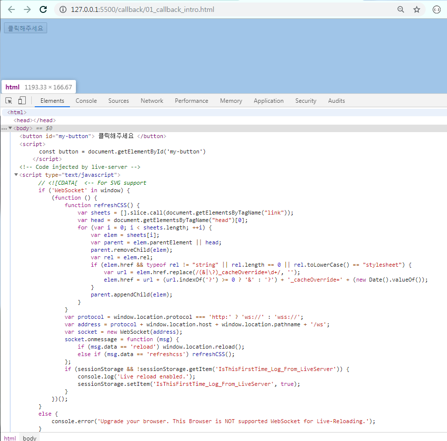

  <br>

- 이벤트 핸들러 사용하기

  - '클릭해주세요' 버튼을 누르면 console 창에 '버튼이 클릭됨' 이 출력된다. 

    ```html
    <html>
      <head></head>
      <body>
        <button id="my-button"> 클릭해주세요 </button>
    
        <script>
          const button = document.getElementById('my-button')
          button.addEventListener('click', function(){
            console.log('버튼이 클릭됨')
          })
        </script>
    
      </body>
    </html>
    ```

    <br>

  - 실행 화면

    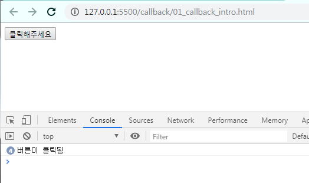

    <br>


### 1.2 예시

#### 1.2.1 함수 정의

```javascript
function doSomething(task){
	alert(`자, 이제 ${task} 준비를 시작해볼까?`)
}

undefined
doSomething('해커톤')
```

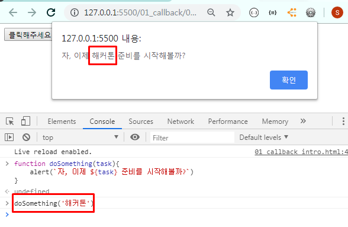

<br>

#### 1.2.2 익명 함수인 콜백 함수 추가

- 먼저 doSomething()이 수행 된후, 익명 함수로 정의한 콜백 함수가 수행된다. 

  ```javascript
  function doSomething(task, callback){
  	alert(`자, 이제 ${task} 준비를 시작해볼까?`)
  	callback()
  }
  
  undefined
  doSomething('해커톤', function(){
  	alert('당장 이번주 금요일부터 시작이야...')
  })
  undefined
  ```
  
  - 실행 화면
  
    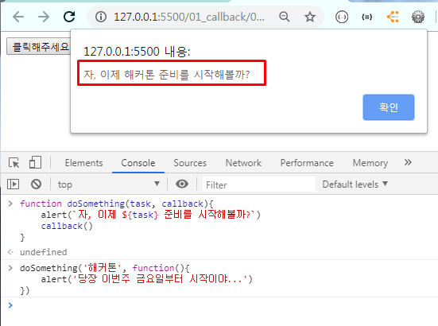
  
    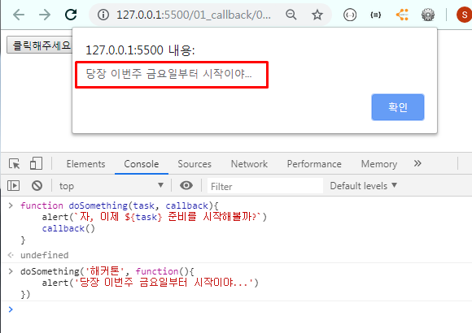
  
    <br>


#### 1.2.3 기명 함수인 콜백 함수로 변경해서 추가

- 우리가 원하는 시점에 함수를 호출해서 사용할 수 있게 되었다. 

  ```javascript
  function doSomething(task, callback) {
  	alert(`자, 이제 ${task} 준비를 시작해볼까?`)|
	callback()
  }
  function alertStart() {
  	alert('당장 이번주 금요일부터 시작이야... :)')
  }
  doSomething('해커톤', alertStart)
  ```
  
  - 실행 화면
  
    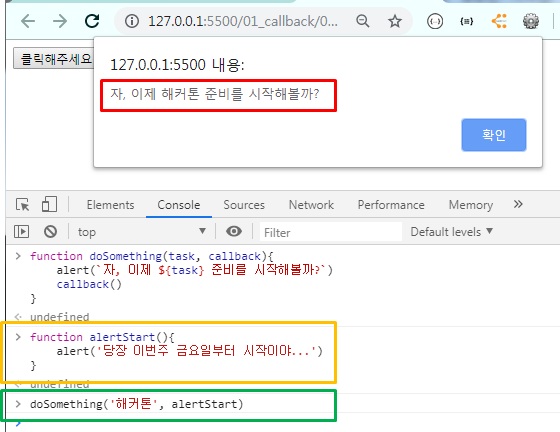
  
    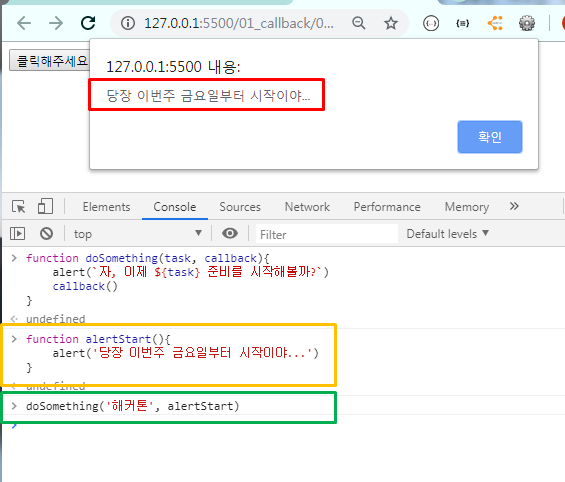
  
    


<br><br>

## 2. EventListener

### 2.1 정의

- 특정한 이벤트가 발생했을 때 실행되는 함수 또는 절차

  1. 무엇을 -> EventTarget
  2. 언제 -> Type의 행위를 했을 떄
  3. 어떻게 -> (주로) Listener에 구현된 함수를 실행

- `addEventListener` 메소드 구성 요소

  > ```javascript
  > EventTarget.addEventListener(type, listener)
  > ```
  >
  > - **EventTarget** : 이벤트 리스너를 등록할 대상 ( -> DOM 노드)
  > - **type** : 이벤트 유형을 뜻하는 문자열 (`click`, `mouseover` 등)
  > - **listener** : 이벤트가 발생했을 때 처리를 담당하는 콜백 함수 
  >   - 인수로 이벤트 객체인 `e`를 전달 받는다. 

<br>

### 2.2 예시

1. (무엇을) 특정한 DOM요소를 
   - button을
2. (언제) 어떠한 행동을 했을 때 
   - click 했을 때
3. (어떻게) 한다. 
   - '뿅' 한다.


```php+HTML
<html>
  <head></head>
  <body>
    <div id="my">
    </div>

    <button id="this-button"> Click me!</button>

    <script>
      // 1. 무엇을 -> 버튼을 (EventTarget)
      const button = document.querySelector('#this-button')
      // 2. 언제 -> 'click' 하면 (type : 'click')
      button.addEventListener('click', function(event){
        console.log(event)
        const area = document.querySelector('#my')
        // 3. 어떻게 -> '뿅'하고 나온다.
        area.innerHTML = '<h1>뿅</h1>'

      })

    </script>

  </body>
</html>
```

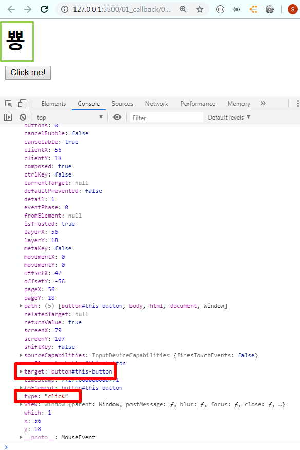

<br>

<br>

## 3. Google dino

### 3.1 BOM & DOM

#### 3.1.1 BOM

> **BOM** (Browser Object Model) : JavaScript가 브라우저와 소통하기 위한 모델
>
> - 브라우저 제작사마다 세부사항이 다소 다르게 구현되고 한정적이다.
> - 웹 브라우저의 창, 프레임을 추상화해서 프로그래밍 적으로 제어할 수 있도록 수단을 제공한다.
> - 전역 객체인 `window`의 프로퍼티와 메소드들을 통해서 제어할 수 있다.
>
> 
>
> `window` 객체는 모든 브라우저로부터 지원 받으며, 이는 브라우저 window 자체를 의미한다.
>
> 
>
> **모든 전역 JavaScript 객체, 함수, 변수들은 자동으로 `window` 객체의 멤버가 된다.** 
>
> - HTML DOM에 있는 `document` 객체 역시 `window` 객체의 속성이다.
>
> ``` 
> window.print()		// 인쇄창 열기
> window.open()		// 브라우저 탭 열기
> window.confirm() 	// 브라우저 대화상자 열기
> window.document 	// document 역시 브라우저에 종속 -> window 전역 객체에 포함
> ```

<br><br>

#### 3.1.2 DOM

> **DOM** (Browser Object Model) : JavaScript가 브라우저와 소통하기 위한 모델
>
> - JavaScript 로 브라우저를 조작하기 위한 언어
>   - **DOM을 통해서 HTML 파일에 작성되는 여러 요소 (Element) 들을 조작**할 수 있다.
>   - DOM 이라는 객체를 통해서 요소를 선택할 수 있고, 선택한 요소의 속성 값을 수정하거나 삭제할 수도 있다. 
>   - 요소에 이벤트를 등록해서 특정 이벤트가 발생할 시 특정 함수가 실행하도록 만들 수 있다. 
>   - HTML 문서에 작성하지 않은 새로운 요소를 생성해서 원하는 위치에 삽입할 수 있다. 

<br>

### 3.2 사전 준비


### 3.3 요소 (Element) 선택

- JavaScript를 이용해 요소를 선택해서 객체로 return 하기

- 브라우저 환경에서 사용하는 JavaScript에는 document 객체가 내장되어 있다. 이 객체를 통해서 HTML 파일을 조작할 수 있다. 

  

  <br>


<br>


#### 3.3.1 변수 할당

> 요소를 선택해서 변수를 할당한다.

<br>

- `document`의 `querySelector` 혹은 `querySelectorAll` 함수를 통해 CSS 선택자로 원하는 요소를 선택할 수 있다. 

  - `querySelector` : 위에서부터 선택자로 요소를 찾으며 가장 먼저 찾아지는 요소 return 

    (**단수**)

    ```
    document.querySelector('.bg')
    ```

    

  - `querySelectorAll` : 위에서부터 선택자로 요소를 찾으며 일치하는 요소를 전부 return

    (**복수**)

    ```
    document.querySelectorAll('.bg')
    ```

    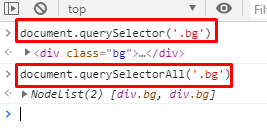

    <br>

- 변수 할당하기

  - `.bg`라는 클래스가 가진 태그, 그 자식 태그까지 전부 변수에 담는다. 

    ```javascript
    <script>
        const bg = document.querySelector('.bg')
    </script>
    ```

    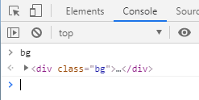

  <br>

  - `bg` 변수 역시 **DOM 객체**이기 때문에 `quertSelector`를 사용할 수 있다. 

    ```javascript
    <script>
        const bg = document.querySelector('.bg')
        const dino = bg.querySelector('#dino')
    </script>
    ```

    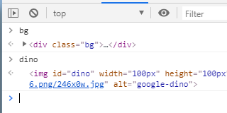

  

<br>


### 3.4 속성 추가 및 삭제

#### 3.4.1 요소의 속성 확인

```
dino.alt
dino.src
```

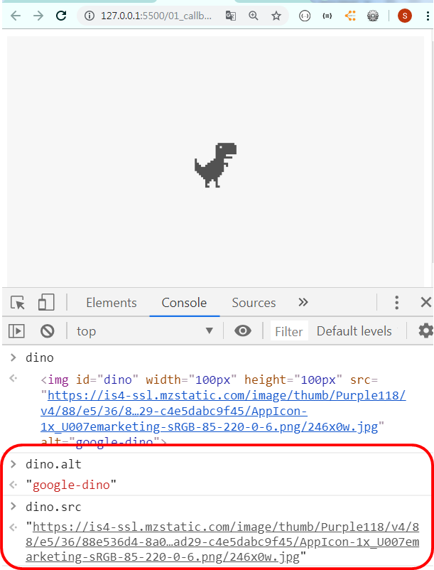

<br>

#### 3.4.2 요소의 속성 변경

```
dino.src = ""
dino.src = "https://miro.medium.com/max/300/0*9U_PkckAUtKGrb_R.png"
```

- `dino.src` 속성은 빈 값으로 변경한다.

  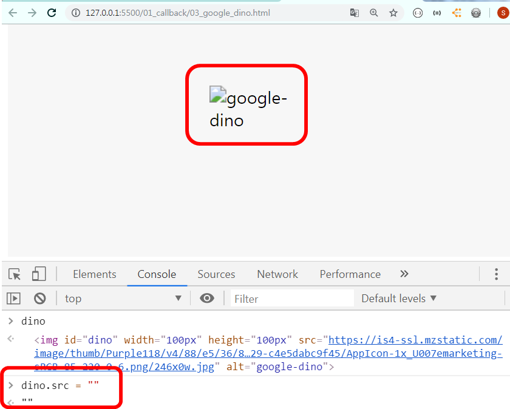

  <br>

- `dino.src` 속성 값을 변경한다.

  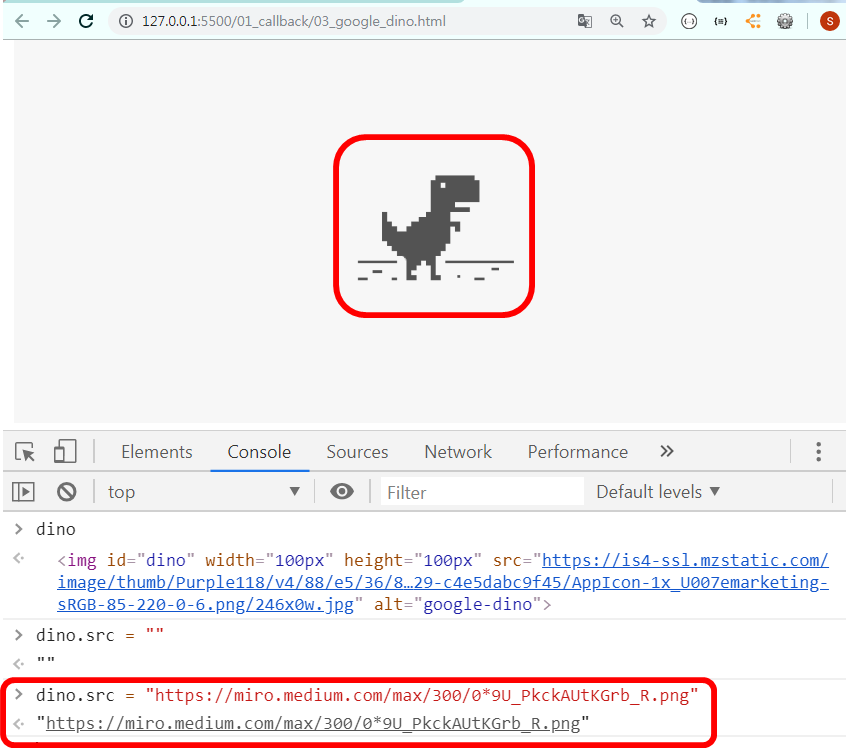

  <br>

#### 3.4.3 요소의 스타일 확인 및 변경

```
dino.style
dino.style.width = '300px'
```

- `dino.style` 확인하기 

  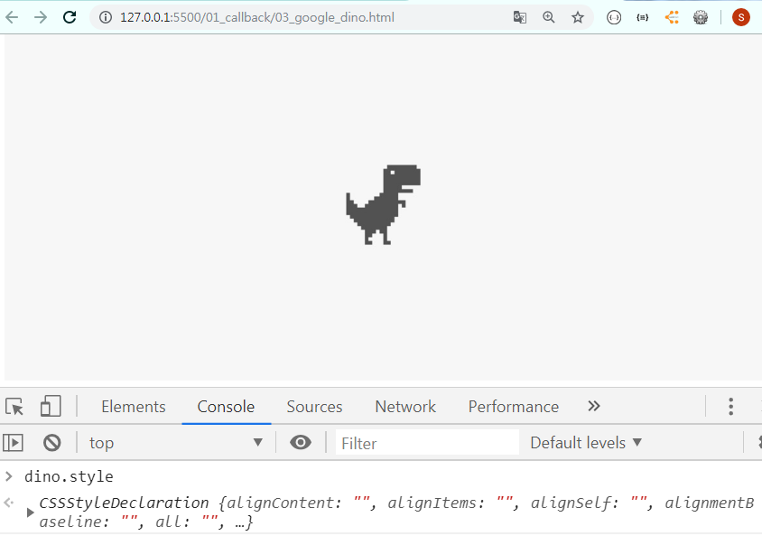

  <br>

- `dino.style.width` 변경하기

  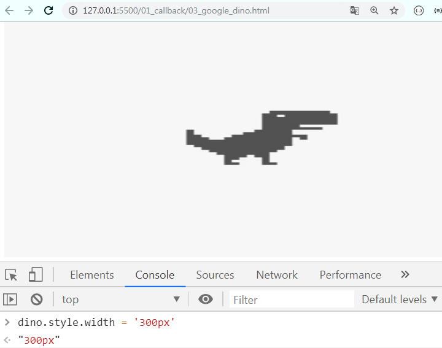

  <br>

### 3.5 요소 추가 및 삭제

#### 3.5.1 요소 삭제

- 요소가 가지고 있는 `remove`함수를 통해 해당 요소를 삭제할 수 있다. 

  ```javascript
  const dino = document.querySelector('#dino')
  dino.remove()
  ```

  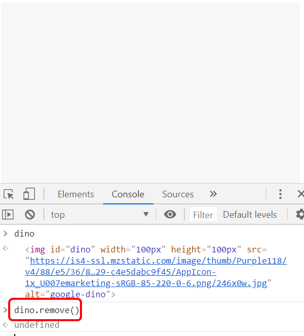

  <br>


#### 3.5.2 원하는 대상의 자식 요소 삭제

- 자식을 선택해서 삭제할 수 있다. 

- `removeChild` 함수를 통해 querySelector를 통해 가져온 태그 내의 특정 자식 요소를 삭제할 수 있다. 

  ```javascript
  bg.firstElementChild.remove() // 첫번째 자식 요소를 삭제
  bg.lastElementChild.remove()  // 마지막 자식 요소를 삭제
  bg.removeChild(dino) 		  // 자식 요소들 중 원하는 요소를 선택해 삭제
  ```

  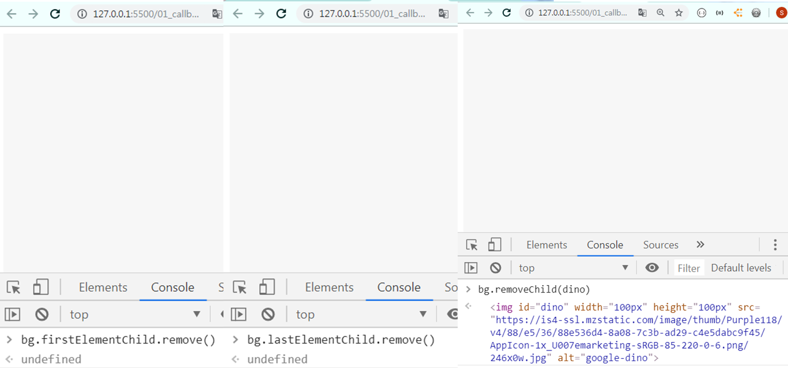

  <br>

  

#### 3.5.3 새로운 요소 생성

- `createElement` 함수를 통해서 새로운 요소를 생성할 수 있다. 

  - 새롭게 생성되는 태그는 어떠한 속성이나 값이 없는 상태이기 때문에, 일일이 값을 할당해야 한다. 

    ```javascript
    const newDino = document.createElement('img')
    ```

    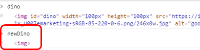

    <br>

  - 태그에 스타일 부여 

    ```javascript
    // 새로운 공룡 생성
        const newDino = document.createElement('img')
        newDino.src = 'https://cdn11.bigcommerce.com/s-6f7df/images/stencil/2048x2048/products/378/2144/ChromeDino-figure-set-side1-1280sq__01031.1552062134.jpg?c=2'
        newDino.alt = 'dino'
        newDino.id = 'dino'
        newDino.style.width = '100px'
        newDino.style.height = '100px'
    ```

    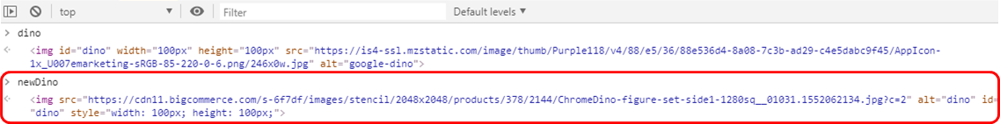

    <br>


#### 3.5.4 대상에 요소 추가하기

- 단순한 태그 생성만으로는 새로운 요소가 DOM에 자동으로 랜더링되지는 않는다. 

- 삽입하고 싶은 위치에서 부모 요소의 `append`함수를 통해 **가장 마지막에 추가**해주거나,

  `insertBefore` 함수를 통해 **자식 요소 중 특정 요소 전에 삽입**할 수 있다. 

  - append() : 특정 태그의 자식 태그 중 마지막에 요소를 추가

    ```javascript
    bg.append(newDino)
    ```

    <br>

  - insertBefore() : 특정 태그의 특정 자식 태그 중 가장 처음에 요소를 추가

    ```javascript
    bg.insertBefore(newDino, bg.firstElementChild)
    ```

    


<br>

### 3.6 대상에 EventListener 추가

- 요소에 이벤트를 등록하여 해당 이벤트가 발생할 때마다 설정한 삼수가 실행되도록 한다. 

- 이벤트 (Event) : 어떤 사건

  - 사용자가 버튼을 클릭했을 때, 웹 페이지가 정상적으로 로드되었을 때 등등 

- 이벤트가 발생하는 시점 및 순서는 **예측 불가**하므로, 이벤트가 발생하는 순간을 감지라고 그에 대응하는 처리가 필요하다. 

  - 브라우저는 이벤트를 감지하고, 이벤트가 발생하면 이를 알려준다. 

    그래서 웹 페이지가 사용자와의 상호작용 (Interaction) 이 가능해진다. 

<br>

#### 3.6.1 이벤트 등록 

> **`addEventListener`를 통해 특정 요소에 이벤트를 등록할 수 있다.** 
>
> - 첫번째 인수 : 이벤트의 Type
> - 두번째 인수 : 실행하고자 하는 함수 
>
> 
>
> **MDN 이벤트 참조** 
>
> 1. 키보드 이벤트 
>    - `keydown` : 키를 눌렀을 때 
>    - `keyup` : 키 누름이 해제될 때 
> 2. 마우스 이벤트 
>    - `click` : 포인팅 장치 버튼 (어떠한 요소에서 눌렀다가 놓았을 때)
> 3. 진행 이벤트
>    - `error` : 진행 실패했을 때
>    - `load` : 진행 성공했을 때 

<br>

- 사용자가 dino라는 요소를 클릭했을 때, 이 클릭 이벤트가 발생할 때마다 '아야!!!' 라는 문자열을 출력하는 이벤트 등록

  ```javascript
  <script>
      const bg = document.querySelector('.bg')
  const dino = bg.querySelector('#dino')
  
  // 사용자가 dino라는 요소를 클릭했을 때, 이 클릭 이벤트가 발생할 때마다 '아야!!!' 라는 문자열을 출력하는 이벤트 등록
  dino.addEventListener('click', function(){
      console.log('아야!')
  })
  </script>
  ```

  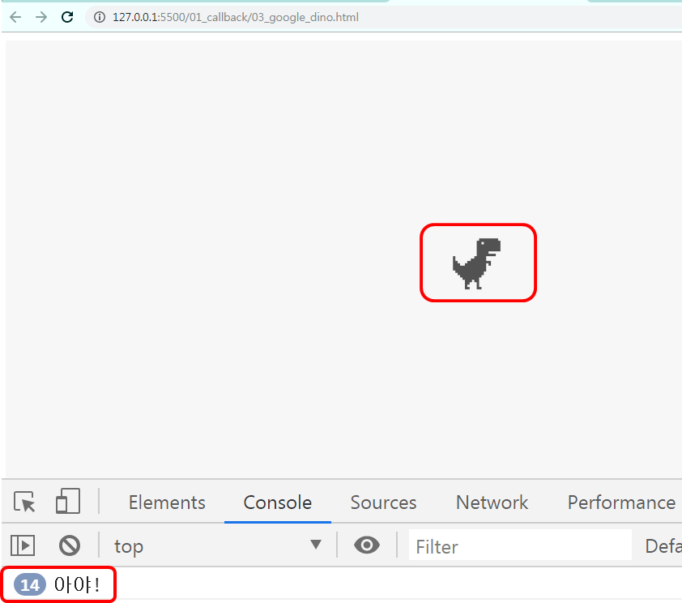


<br>

#### 3.6.2 발생한 이벤트 확인

- `addEventListener` 함수는 이벤트가 발생할 때마다 실행시키는 함수의 인자로 `event`라는 객체를 넘겨준다.

  - `event ` 객체를 통해 어떤 이벤트가 발생했는지 확인할 수 있다. 

    `event` 객체는 일반적으로 줄여서 `e`라고 정의한다. 

    ```javascript
    dino.addEventListener('click', function(e){
        console.log(e)
        console.log('아야!')
    })
    ```

    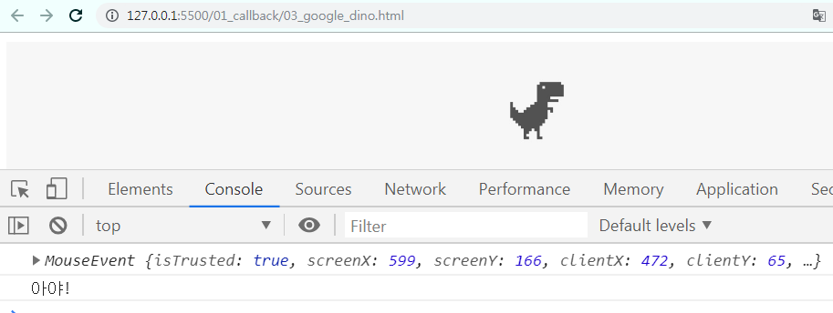

    <br>


### 3.7 문서 전체에 EventListener 추가

> 해당 페이지 전체에 키보드 입력 이벤트를 등록하여 어떤 키가 눌렸는지를 확인해보자!

<br>

#### 3.7.1 이벤트 등록 및 입력 키 확인하기

- 키보드 입력 이벤트 중 `keydown`을 사용해서 키보드 이벤트 등록

  - 문서 전체에 키 입력을 확인하는 이벤트 리스너 등록

    ```javascript
    document.addEventListener('keydown', function(e){
        console.log(e)
    })
    ```

    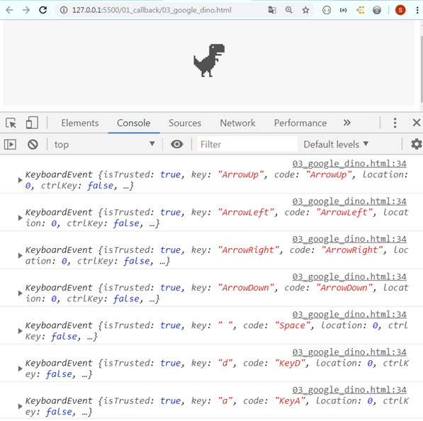

    <br>

  


#### 3.7.2 조건문으로 입력 값 구분하기

- 방향키 (상,하,좌,우) , '스페이스바' 외의 다른 키보드 입력에 따른 log 찍기

  ```javascript
  document.addEventListener('keydown', function(e){
      console.log(e)
      if (e.code === 'ArrowUp'){
          console.log('ArrowUp')                
      } else if (e.code === 'ArrowDown'){
          console.log('ArrowDown')
      } else if (e.code === 'ArrowLeft'){
          console.log('ArrowLeft')
      } else if (e.code === 'ArrowRight'){
          console.log('ArrowRight')
      } else if (e.code === 'Space'){
          console.log('Space')
      } else {
          console.log('잘못 눌렀어요..')
      }
  })
  
  ```

  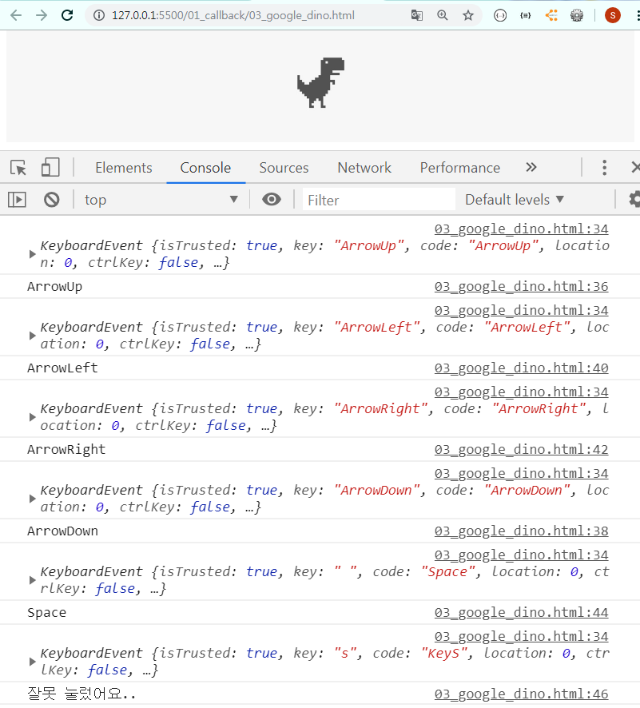

  <br>


### 3.8 살아 움직이는 공룡

#### 3.8.1 [ Step 1 ] 

> 방향키 입력 시 공룡이 움직이게 만들기
>
> - dino의 style에 margin 값을 부여하면...?
>
>   ```
>   dino.style.marginRight = '20px'
>   ```

<br>

```javascript
document.addEventListener('keydown', function(e){
    console.log(e)
    if (e.code === 'ArrowUp'){
        console.log('Up')
        dino.style.marginBottom = '20px'
    } else if (e.code === 'ArrowDown'){
        console.log('Dowm')
        dino.style.marginTop = '20px'
    } else if (e.code === 'ArrowLeft'){
        console.log('Left')
        dino.style.marginRight = '20px'
    } else if (e.code === 'ArrowRight'){
        console.log('Right')
        dino.style.marginLeft = '20px'
    } else if (e.code === 'Space'){
        console.log('Space')
        alert('크아아아아앙쥬')
    } else {
        console.log('잘못 눌렀어요~')
    }
})
```

**문제발생!!** 

한번만 움직이고 더이상 움직이지 않는다. 

- margin 값을 더해주는 것이 아니라, 똑같이 20px이라는 값을 재할당하기 때문!

<br>

#### 3.8.1 [ Step 2 ] 

> x와 y  변수에 기본값 0을 할당하고, 방향키가 입력될 때마다 margin 값을 계속해서 더하고 빼는 과정을 통해 공룡의 위치를 이동시키자. 

<br>

```javascript
let x=0
let y=0

document.addEventListener('keydown', function(e){
    console.log(e)

    if (e.code === 'ArrowUp'){
        console.log('Up')
        y += 20
        dino.style.marginBottom = `${y}px`
    } else if (e.code === 'ArrowDown'){
        console.log('Dowm')
        y -= 20
        dino.style.marginBottom = `${y}px`
    } else if (e.code === 'ArrowLeft'){
        console.log('Left')
        x -= 20
        dino.style.marginLeft = `${x}px`
    } else if (e.code === 'ArrowRight'){
        console.log('Right')
        x += 20
        dino.style.marginLeft = `${x}px`
    } else if (e.code === 'Space'){
        console.log('Space')
        alert('크아아아아앙쥬')
    } else {
        console.log('방향키와 스페이스바만 이용하세요')
    }
})
```

<br>


```javascript
<!DOCTYPE html>
<html lang="en">
<head>
  <meta charset="UTF-8">
  <meta name="viewport" content="width=device-width, initial-scale=1.0">
  <meta http-equiv="X-UA-Compatible" content="ie=edge">
  <title>Document</title>
  <style>
    .bg {
      background-color: #f7f7f7;
      display: flex;
      justify-content: center;
      align-items: center;
      min-height: 100vh;
    }
  </style>
</head>
<body>
  <div class="bg">
    
  </div>
  <script>
    const bg = document.querySelector('.bg')
    const dino = bg.querySelector('#dino')

    // 사용자가 dino라는 요소를 클릭했을 때, 이 클릭 이벤트가 발생할 때마다 '아야!!!' 라는 문자열을 출력하는 이벤트 등록
    dino.addEventListener('click', function(e){
      console.log(e)
      console.log('아야!')
    })

    let x=0
    let y=0

    document.addEventListener('keydown', function(e){
      console.log(e)

      if (e.code === 'ArrowUp'){
        console.log('Up')
        y += 20
        dino.style.marginBottom = `${y}px`
      } else if (e.code === 'ArrowDown'){
        console.log('Dowm')
        y -= 20
        dino.style.marginBottom = `${y}px`
      } else if (e.code === 'ArrowLeft'){
        console.log('Left')
        x -= 20
        dino.style.marginLeft = `${x}px`
      } else if (e.code === 'ArrowRight'){
        console.log('Right')
        x += 20
        dino.style.marginLeft = `${x}px`
      } else if (e.code === 'Space'){
        console.log('Space')
        alert('크아아아아앙쥬')
      } else {
        console.log('방향키와 스페이스바만 이용하세요')
      }
    })

    // 움직이는 공룡
    dino.style.position = 'absolute'
    dino.addEventListener('mouseover', function(){
      // [현재 윈도우 너비 * 난수] - [현재 윈도우 너비 / 2]
      const newWidth = window.innerWidth * Math.random() - window.innerWidth / 2 
      const newHeight = window.innerHeight * Math.random() - window.innerHeight / 2

      // dino의 마진 값을 새롭게 할당한다.
      dino.style.marginLeft = newWidth + 'px'
      dino.style.marginTop = newHeight + 'px'


    })


  </script>
</body>
</html>

```

<br>


#### 3.8.3 도망가는 공룡

- `Math.random()` : 0 ~ 1 사이의 부동 소수점 난수 return 
- `window.innerHeight` : 현재 보고 있는 브라우저 화면의 높이 
- `window.innerWidth` : 현재 보고 있는 브라우저 화면의 너비


```javascript
// 움직이는 공룡
dino.style.position = 'absolute'
dino.addEventListener('mouseover', function(){
    // [현재 윈도우 너비 * 난수] - [현재 윈도우 너비 / 2]
    const newWidth = window.innerWidth * Math.random() - window.innerWidth / 2 
    const newHeight = window.innerHeight * Math.random() - window.innerHeight / 2

    // dino의 마진 값을 새롭게 할당한다.
    dino.style.marginLeft = newWidth + 'px'
    dino.style.marginTop = newHeight + 'px'

})
```

