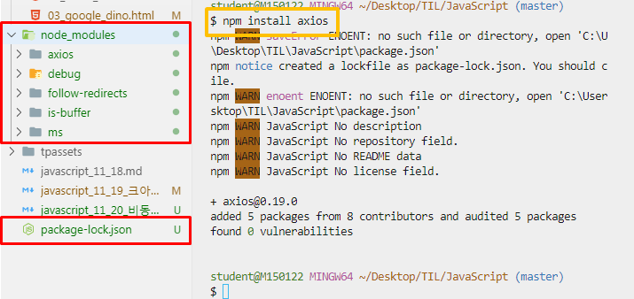
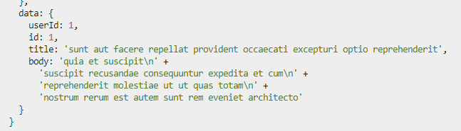
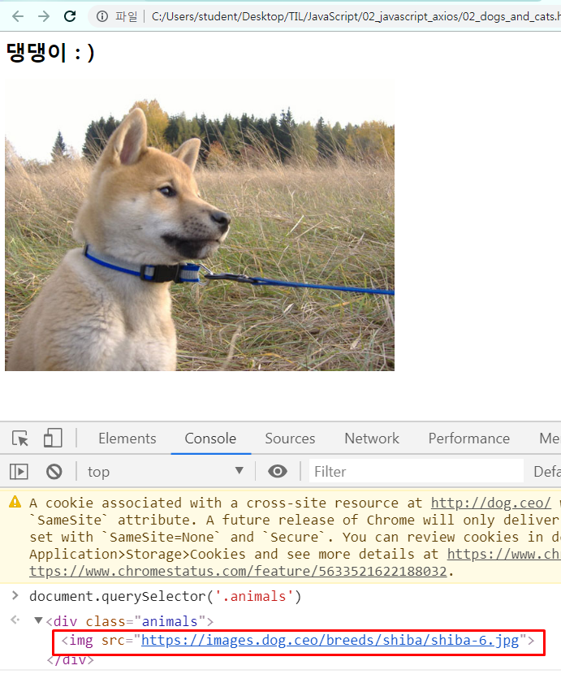

# 비동기 처리

## Axios

> 브라우저와 Node.js에서 사용할 수 있는 `Promise` 기반의 HTTP 클라이언트 라이브러리이다.
>
> - 비동기 방식
> - HTTP 데이터 요청을 실행한다.
> - 내부적으로는 직접적으로 XMLHttpRequest를 다루지 않고, Ajax 호출을 보낼 수 있다.
>
> [자세히](https://github.com/axios/axios)
>
> `Promise` (ES6)
>
> - 비동기 요청을 보내고 응답을 받았을 때, 그 응답 결과를 어떻게 처리할것인지에 대한 약속(Promise) 하는 것
>   - `.then` 
>     - 응답이 정상적으로 왔을 경우 
>     - 이제 어떻게 처리할지를 결정한다.
>   - `.catch`
>     - 응답이 제대로 오지 않았을 경우
>     - 에러 처리!!

<br>

Ajax

- XMLHttpRequest를 사용해서 본인이 원하는 부분을 일부분만 바꿀 수 있다. 

- 새로운 통신 규약이 아닌, 기존의 HTTP를 효과적으로 사용하기 위한 방법 중 하나일 뿐 


HTTP -> Ajax -> WebSocket

[웹소켓](https://engineering.huiseoul.com/%EC%9E%90%EB%B0%94%EC%8A%A4%ED%81%AC%EB%A6%BD%ED%8A%B8%EB%8A%94-%EC%96%B4%EB%96%BB%EA%B2%8C-%EC%9E%91%EB%8F%99%ED%95%98%EB%8A%94%EA%B0%80-%EC%9B%B9%EC%86%8C%EC%BC%93-%EB%B0%8F-http-2-sse-1ccde9f9dc51) 

## 0. 설치

- node.js 설치 시, npm 가 함께 설치된다. 

  ```bash
  $ npm install axios
  ```

  - 설치가 완료되면, 폴더가 생긴다. 

    

<br>

- Axios GET 요청해보기

  - 01_axios.js

    ```javascript
    const axios = require('axios')
    
    // axios를 통해 GET 요청
    axios.get('https://jsonplaceholder.typicode.com/posts/1')
    .then(response => {
      console.log(response)
    })
    .catch(error => {
      console.log(error)
    })
    ```

    

<br><br>

## 1. Dog and Cat

> 강아지 API [바로가기](https://dog.ceo/)
>
> - `axios`를 이용하여 강아지 API로부터 랜덤으로 강아지 사진을 가져온다. 

<br>

- img url  찾기

  `response.data.message`

  ```javascript
  <div class="animals"></div>
  <script src="https://unpkg.com/axios/dist/axios.min.js"></script>
  <script> axios.get('https://dog.ceo/api/breeds/image/random')
      .then(response => {
      console.log(response.data.message)
  })
      .catch(error => {
      console.log(error)
  })
  </script>
  ```

<br>

- img URL 을 변수에 담는다.

  ```javascript
  const imgUrl = response.data.message
  ```

  <br>

- img 태그를 만든다.

  ```javascript
  const imgTag = document.createElement('img')
  ```

  <br>

- src 속성을 추가한다.

  ```javascript
  imgTag.src = imgUrl
  ```

  <br>

- HTML 문서에 요소를 위치시킨다.

  ```javascript
  document.querySelector('.animals').appendChild(imgTag)
  ```

<br>

- 코드

  ```javascript
  <div class="animals"></div>
  <script src="https://unpkg.com/axios/dist/axios.min.js"></script>
  <script>
      axios.get('https://dog.ceo/api/breeds/image/random')
      .then(response => {
      // 1. img URL 을 변수에 담는다.
      const imgUrl = response.data.message
  
      // 2. img 태그를 만든다.
      const imgTag = document.createElement('img')
  
      // 3. src를 추가한다.
      imgTag.src = imgUrl
  
      // 4. HTML 문서에 요소를 위치시킨다.
      document.querySelector('.animals').appendChild(imgTag)
  })
      .catch(error => {
      console.log(error)
  })
  
  </script>
  
  ```

  <br>

- 실행 화면

  

  <br>

- 함수로 작성하여, 함수를 호출할 때마다 강아지 사진이 랜덤으로 추가된다. 

  - 코드

    `const getDogImage = () => {}`안의 위의 script 코드를 작성한다.

    ```
    <script>
          const getDogImage = () => {
            axios.get('https://dog.ceo/api/breeds/image/random')
            .then(response => {
              // 1. img URL 을 변수에 담는다.
              const imgUrl = response.data.message
    
              // 2. img 태그를 만든다.
              const imgTag = document.createElement('img')
    
              // 3. src를 추가한다.
              imgTag.src = imgUrl
    
              // 4. HTML 문서에 요소를 위치시킨다.
              document.querySelector('.animals').appendChild(imgTag)
            })
            .catch(error => {
              console.log(error)
            })
          }
        </script>
    ```


- 버튼을 선택하고, 버튼을 클릭하면 만들어둔 콜백함수가 실행된다. 


