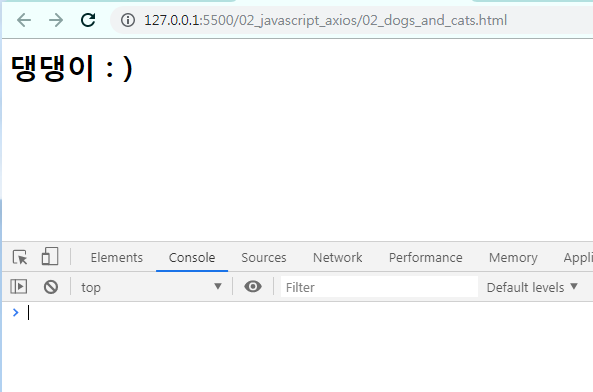
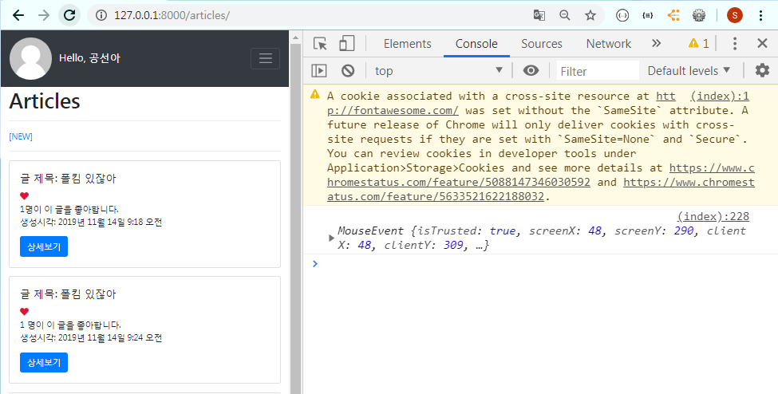

# 비동기 처리

## Axios

> 브라우저와 Node.js에서 사용할 수 있는 `Promise` 기반의 HTTP 클라이언트 라이브러리이다.
>
> - 비동기 방식
> - HTTP 데이터 요청을 실행한다.
> - 내부적으로는 직접적으로 XMLHttpRequest를 다루지 않고, Ajax 호출을 보낼 수 있다.
>
> [자세히](https://github.com/axios/axios)
>
> `Promise` (ES6)
>
> - 비동기 요청을 보내고 응답을 받았을 때, 그 응답 결과를 어떻게 처리할것인지에 대한 약속(Promise) 하는 것
>   - `.then` 
>     - 응답이 정상적으로 왔을 경우 
>     - 이제 어떻게 처리할지를 결정한다.
>   - `.catch`
>     - 응답이 제대로 오지 않았을 경우
>     - 에러 처리!!

<br>

Ajax

- XMLHttpRequest를 사용해서 본인이 원하는 부분을 일부분만 바꿀 수 있다. 

- 새로운 통신 규약이 아닌, 기존의 HTTP를 효과적으로 사용하기 위한 방법 중 하나일 뿐 


HTTP -> Ajax -> WebSocket

[웹소켓](https://engineering.huiseoul.com/%EC%9E%90%EB%B0%94%EC%8A%A4%ED%81%AC%EB%A6%BD%ED%8A%B8%EB%8A%94-%EC%96%B4%EB%96%BB%EA%B2%8C-%EC%9E%91%EB%8F%99%ED%95%98%EB%8A%94%EA%B0%80-%EC%9B%B9%EC%86%8C%EC%BC%93-%EB%B0%8F-http-2-sse-1ccde9f9dc51) 


## 0. 설치

- node.js 설치 시, npm 가 함께 설치된다. 

  ```bash
  $ npm install axios
  ```

  - 설치가 완료되면, 폴더가 생긴다. 

    

<br>

### jsonplaceholder

> 가상의 데이터를 제공하여 테스트시에 용이하게 사용할 수 있다. 
>
> 

<br>

- Axios GET 요청해보기

  - 01_axios.js

    ```javascript
    const axios = require('axios')
    
    // axios를 통해 GET 요청
    axios.get('https://jsonplaceholder.typicode.com/posts/1')
    .then(response => {
      console.log(response)
    })
    .catch(error => {
      console.log(error)
    })
    ```

    

<br><br>

## 1. Dog and Cat

> 강아지 API [바로가기](https://dog.ceo/)
>
> - `axios`를 이용하여 강아지 API로부터 랜덤으로 강아지 사진을 가져온다. 

<br>

### 1.2 Dog

`response.data`구조


<br>

#### [ 기본 ]

- img url  찾기

  `response.data.message`

  ```javascript
  <div class="animals"></div>
  <script src="https://unpkg.com/axios/dist/axios.min.js"></script>
  <script> axios.get('https://dog.ceo/api/breeds/image/random')
      .then(response => {
      console.log(response.data.message)
  })
      .catch(error => {
      console.log(error)
  })
  </script>
  ```

<br>

- img URL 을 변수에 담는다.

  ```javascript
  const imgUrl = response.data.message
  ```

  <br>

- img 태그를 만든다.

  ```javascript
  const imgTag = document.createElement('img')
  ```

  <br>

- src 속성을 추가한다.

  ```javascript
  imgTag.src = imgUrl
  ```

  <br>

- HTML 문서에 요소를 위치시킨다.

  ```javascript
  document.querySelector('.animals').appendChild(imgTag)
  ```

<br>

- 코드

  ```javascript
  <div class="animals"></div>
  <script src="https://unpkg.com/axios/dist/axios.min.js"></script>
  <script>
      axios.get('https://dog.ceo/api/breeds/image/random')
      .then(response => {
      // 1. img URL 을 변수에 담는다.
      const imgUrl = response.data.message
  
      // 2. img 태그를 만든다.
      const imgTag = document.createElement('img')
  
      // 3. src를 추가한다.
      imgTag.src = imgUrl
  
      // 4. HTML 문서에 요소를 위치시킨다.
      document.querySelector('.animals').appendChild(imgTag)
  })
      .catch(error => {
      console.log(error)
  })
  
  </script>
  
  ```

  <br>

- 실행 화면

  

  <br>

#### [ 콜백 함수 ]

- 함수로 작성하여, 함수를 호출할 때마다 강아지 사진이 랜덤으로 추가된다. 

  - script 코드

    `const getDogImage = () => {}`안의 위의 script 코드를 작성한다.

    ```javascript
    <script>
        const getDogImage = () => {
            axios.get('https://dog.ceo/api/breeds/image/random')
                .then(response => {
                // 1. img URL 을 변수에 담는다.
                const imgUrl = response.data.message
    
                // 2. img 태그를 만든다.
                const imgTag = document.createElement('img')
    
                // 3. src를 추가한다.
                imgTag.src = imgUrl
    
                // 4. HTML 문서에 요소를 위치시킨다.
                document.querySelector('.animals').appendChild(imgTag)
            })
                .catch(error => {
                console.log(error)
            })
        }
    </script>
    ```

<br>

- 실행 화면

  - 초기화면에는 사진이 없다. 

    

    <br>

  - console 창에 `getDogImage` 함수를 호출할 때마다 강아지 사진이 추가된다. 

    


<br>

#### [ 버튼 + 콜백 함수 ]

- 버튼을 선택하고, 버튼을 클릭하면 만들어둔 콜백함수가 실행되도록 수정한다

  - script 코드 : 버튼에 콜백함수를 이벤트로 지정한다.

    `const dogButton = document.querySelector('#dog')
    dogButton.addEventListener('click', getDogImage)`

    ```javascript
    <button id="dog">댕댕이 나와라</button>
    <script src="https://unpkg.com/axios/dist/axios.min.js"></script>
    <script>
        const getDogImage = () => {
            axios.get('https://dog.ceo/api/breeds/image/random')
                .then(response => {
                // 1. img URL 을 변수에 담는다.
                const imgUrl = response.data.message
    
                // 2. img 태그를 만든다.
                const imgTag = document.createElement('img')
    
                // 3. src를 추가한다.
                imgTag.src = imgUrl
                imgTag.style.width = '200px'
                imgTag.style.height = '200px'
    
                // 4. HTML 문서에 요소를 위치시킨다.
                document.querySelector('.animals').appendChild(imgTag)
            })
                .catch(error => {
                console.log(error)
            })
        }
    
        axios.get('https://api.thecatapi.com/v1/images/search')
            .then(response => {
            console.log(response.data[0].url)
        })
            .catch(error => {
            console.log(error)
        })
    
        // 버튼을 선택하고, 버튼을 클릭하면 만들어둔 콜백함수가 실행된다. 
        const dogButton = document.querySelector('#dog')
        dogButton.addEventListener('click', getDogImage)
    </script>
    ```

  <br>

- 실행 화면

  - 버튼을 누르면 강아지 사진이 추가된다.

    

    <br>

  - 버튼을 누를 때마다 강아지 사진이 추가된다.

    


<br>

### 1.3 Cat 

> 고양이 버튼을 만들어, 고양이 사진을 가져온다. 
>
> [고양이 API 바로가기](https://docs.thecatapi.com/)

<br>

#### [ 버튼 + 콜백 함수 ]

`response.data` 구조


<br>

- script 코드

  ```javascript
  <script src="https://unpkg.com/axios/dist/axios.min.js"></script>
  <script>
      .
  	.
      const getCatImage = () => {
          axios.get('https://api.thecatapi.com/v1/images/search')
              .then(response => {
  
              const imgUrl = response.data[0].url
              const imgTag = document.createElement('img')
  
              imgTag.src = imgUrl
              imgTag.style.width = '200px'
              imgTag.style.height = '200px'
  
              document.querySelector('.animals').appendChild(imgTag)
          })
              .catch(error => {
              console.log(error)
          })
      }
  
      // 버튼을 선택하고, 버튼을 클릭하면 만들어둔 콜백함수가 실행된다. 
      const catButton = document.querySelector('#cat')
      catButton.addEventListener('click', getCatImage)
  </script>
  ```

- 실행 화면

  

  <br>

  

  


<br>

## 2. Like (GET 요청)

### AJAX 

- Asynchronous JavaScript and XML (비동기 적인 JavaScript와 XML)
- 브라우저에서 웹 페이지를 요청하거나 링크를 클릭하면, 화면 갱신 (새로고침) 이 발생한다. 이는 브라우저와 서버 간의 **통신**이 일어났다는 것이다. 
- JavaScript를 활용해서 비동기적으로 서버와 브라우저가 데이터를 교환할 수 있는 통신 방식이다. 
- 페이지 전체를 다시 로드하는 것이 아니라, 페이지에서 갱신이 필요한 일부분만 로드함으로써 빠른 퍼포먼스와 부드러운 화면 표시가 가능하다.
  - 사용자 경험 (UX) 향상 + 서버 자원 이용 절감 => 두 마리 토끼 다 잡기

<br>

### XMLHttpRequest

- AJAX 통신을 할 때 내부적으로 이용
- 브라우저는 **XHR 객체를 이용해서 AJAX 요청을 생성하고 전송**한다.
- 서버가 브라우저 요청에 응답 내용을 반환하면, 마찬가지로 XHR 객체가 그 결과를 처리한다. 

<br>


### 2.1 좋아요 버튼을 부-드럽게

- 이전에 우리가 구현해본 DJango Code에서는 '좋아요' 버튼을 누르면 페이지 전환(요청)을 통해 '좋아요' 기능이 이루어진다.
- 하지만 `axios`를 사용하면 페이지 전환없이 '좋아요' 기능을 구현할 수 있다.  


_article.html

- 기존의 '좋아요' 기능 코드

  ```django
  <a href="">
      <!-- 사용자가 좋아요 누른 상태 -> 꽉찬 하트 -->
      
      <i class="fas fa-heart"></i>
      <!-- 안 누른 상태 -> 빈 하트 -->
      
      <i class="far fa-heart"></i>
      
  </a>
  ```

<br>


#### 2.1.1 a 태그 삭제, i 태그 수정

- base.html에 Axios CDN을 넣는다.

  ```html
  <!-- Axios CDN -->
  <script src="https://unpkg.com/axios/dist/axios.min.js"></script>
  ```

  

- `i` 태그에 class를 지정한다.

  - querySelector Class로 선택하기 위해 

    ```django
    <i class="like-button fas fa-heart"></i>
    ```


- `i` 태그에 `data-id`를 새로 추가한다.

  - `data-id` : JavaScript가 데이터를 처리할 때 해당 요소가 어떤 article의 번호인지를 구분하기 위해서 지정한다.

    ```django
    
    <i data-id="{{article.pk}}" class="like-button fas fa-heart"></i>
    <!-- 안 누른 상태 -> 빈 하트 -->
    
    <i data-id="{{article.pk}}" class="like-button far fa-heart"></i>
    
    ```


<br>

#### 2.1.2 Template 수정

- index.html에 script 코드를 추가한다.

  - event (e) 의 `Target` 

    - classList : 이벤트가 발생한 좋아요 버튼에 설정된 `class` 목록들이 들어있다. 

    - dataset : 이벤트가 발생한 좋아요 버튼의  `data-id` 로 설정해준 article의 id값이 들어간다.

      

      <br>

  - script 코드

    ```javascript
    <script>
    
        // 1. 모든 좋아요 버튼 가져오기
        const likeButtons = document.querySelectorAll('.like-button')
    
    // 2. forEach 함수 활용 -> 각각의 버튼 하나하나를 꺼내서 특정 동작을 추가한다.
    likeButtons.forEach(button => {
        button.addEventListener('click', function(e){
            console.log(e)
    
            // event.target.classList, event.target.dataset.id
            // 1. data-id에 article.pk가 들어있다. ==> 동적 라우팅 활용
            const articleId = e.target.dataset.id
    
            // 2. 해당 게시글의 '좋아요' 요청 보내기
            axios.get(`/articles/${articleId}/like/`)
            // 3. 응답 결과 확인
                .then( response => {
                console.log(response)
            })
                .catch(error => {console.log(error)})
        })
    })
    
    </script>
    ```

    


<br>

#### 2.1.3 View 수정

- 좋아요 버튼의 `articleId`를 찾아서 좋아요 요청을 보냈을 때, View 로직에서 보내준 boolean 값에 따라 클래스를 지우거나 추가한다.

- redirect 응답에 대한 결과로 `index.html`을 받는게 아니라, JSON 형태로 응답 결과를 반환받는다. 

  - 좋아요 -> `liked = True`
  - 좋아요 취소 -> `liked = False`

  <br>

> Django에서 제공하는 JsonResponse 를 사용해서 JSON 형태로 결과를 반환해보자. 

**참고문서 JsonResponse 사용 예제**

```python 
from django.http import JsonResponse

response = JsonResponse({'foo': 'bar'})
response.content
```

<br>


- views.py

  - '좋아요' 취소인 경우,  `liked = False`로 설정해준다.

  - '좋아요' 인 경우,  `liked = True`로 설정해준다.

    ```python 
    from django.http import JsonResponse
    
    @login_required
    def like(request, article_pk):
        # 좋아요 누른 게시글 가져오기
        article = get_object_or_404(Article, pk=article_pk)
        # 현재 접속하고 있는 User
        user = request.user
        
        # 좋아요 취소
        if user in article.like_users.all():
            article.like_users.remove(user)
            liked = False
        
        # 좋아요 
        else : 
            article.like_users.add(user)
            liked = True
    
        context = {'liked' : liked}
    
        return JsonResponse(context)
    ```

<br>

- index.html

  - `event.target.dataset.id` : 이벤트가 발생한 좋아요 버튼의 게시글 pk 값

  - `event.target.classList` : 이벤트가 발생한 좋아요 버튼에 설정된 class 값들의 목록

    ```javascript
    <script>
    
        // 1. 모든 좋아요 버튼 가져오기
        const likeButtons = document.querySelectorAll('.like-button')
    
    	// 2. forEach 함수 활용 -> 각각의 버튼 하나하나를 꺼내서 특정 동작을 추가한다.
        likeButtons.forEach(button => {
        button.addEventListener('click', function(e){
            console.log(e)
    
            // 1. data-id에 article.pk가 들어있다. ==> 동적 라우팅 활용
            const articleId = e.target.dataset.id
    
            // 2. 해당 게시글의 '좋아요' 요청 보내기
            // like view 함수로 이동
            axios.get(`/articles/${articleId}/like/`)
            // 3. 응답 결과 확인
                .then( response => {
                if (response.data.liked){
                    e.target.style.color = 'crimson'
                } else {
                    e.target.style.color = "gray"
                }
            })
                .catch(error => {console.log(error)})
        })
    })
    
    </script>
    ```

- 실행 화면

  


### 2.2 좋아요 수

- views.py

  ```
  @login_required
  def like(request, article_pk):
      # 좋아요 누른 게시글 가져오기
      article = get_object_or_404(Article, pk=article_pk)
      # 현재 접속하고 있는 User
      user = request.user
      # 현재 게시글에 좋아요를 누른 사람의 목록에서
      # 현재 접속한 User가 있는 경우 -> 좋아요 취소
      if user in article.like_users.all():
          article.like_users.remove(user)
          liked = False
      # 현재 접속한 User가 없는 경우 -> 좋아요 
      # User를 현재 게시글에 좋아요를 누른 사람의 목록에 추가한다. 
      else : 
          # article.like_users.add(user)
          article.like_users.add(user)
          liked = True
  
      context = {
          'liked' : liked,
          'count' : article.like_users.count(),    
      }
      # return redirect('articles:index')
      return JsonResponse(context)
  ```


- _article.html

  ```
  <span id="like-count-{{article.pk}}"> {{ article.like_users.all|length }} </span>명이 이 글을 좋아합니다. <br>
  ```

- index.html script 코드 작성

  ```
  <script>
      
      // 1. 모든 좋아요 버튼 가져오기
      const likeButtons = document.querySelectorAll('.like-button')
  
      // 2. forEach 함수 활용 -> 각각의 버튼 하나하나를 꺼내서 특정 동작을 추가한다.
      likeButtons.forEach(button => {
        button.addEventListener('click', function(e){
          console.log(e)
  
          // event.target.classList, event.target.dataset.id
          // 1. data-id에 article.pk가 들어있다. ==> 동적 라우팅 활용
          const articleId = e.target.dataset.id
  
          // 2. 해당 게시글의 '좋아요' 요청 보내기
          axios.get(`/articles/${articleId}/like/`)
          // 3. 응답 결과 확인
          .then( response => {
  
            // 알맞은 id 값을 가진 span 태그를 선택해서,
            // 사용자가 '좋아요' 누를 때마다 response.data.count 값으로 갱신시킨다. 
            // span 태그 찾기                                   // 넘겨 받은 count로 갱신ㅇ        
            document.querySelector(`#like-count-${articleId}`).innerHTML = response.data.count
  
            if (response.data.liked){
              e.target.style.color = 'crimson'
            } else {
              e.target.style.color = "gray"
            }
          })
          .catch(error => {console.log(error)})
        })
      })
  
    </script>
  ```

  


## 3. Like (POST 요청)

> '좋아요' 는 데이터 베이스에 조작을 영향이 미치는 로직이기 때문에, GET 요청이 아니라 POST 요청이 적절하다. 
>
> - POST 요청으로 변경해보자!

<br>

- POST 요청 

  - `axios.get()` -> `axios.post()`

    ```javascript
    axios.post(`/articles/${articleId}/like/`)
    ```

<br>

- 실행하면 **403 (Forbidden) ERROR**

  

  <br>

  

<br>

<hr>

**해결!!!!**

> 쿠키에 CSRF 를 담아서 서버로 전송한다.
>
> - Django 공식 문서 [참고](https://docs.djangoproject.com/en/2.2/ref/csrf/)

<br>

<hr>

<br>

- post로 요청을 보내기 전에 미리 설정한다.

  ```javascript
  axios.defaults.xsrfCookieName = 'csrftoken'
  axios.defaults.xsrfHeaderName = 'X-CSRFToken'
  ```

- index.html

  ```javascript
  <script>
  
      // 1. 모든 좋아요 버튼 가져오기
      const likeButtons = document.querySelectorAll('.like-button')
  
      // 2. forEach 함수 활용 -> 각각의 버튼 하나하나를 꺼내서 특정 동작을 추가한다.
      likeButtons.forEach(button => {
      button.addEventListener('click', function(e){
          console.log(e)
  
          // event.target.classList, event.target.dataset.id
          // 1. data-id에 article.pk가 들어있다. ==> 동적 라우팅 활용
          const articleId = e.target.dataset.id
          axios.defaults.xsrfCookieName = 'csrftoken'
          axios.defaults.xsrfHeaderName = 'X-CSRFToken'
          // 2. 해당 게시글의 '좋아요' 요청 보내기
          axios.post(`/articles/${articleId}/like/`)
          // 3. 응답 결과 확인
              .then( response => {
  
              // 알맞은 id 값을 가진 span 태그를 선택해서,
              // 사용자가 '좋아요' 누를 때마다 response.data.count 값으로 갱신시킨다. 
              // span 태그 찾기                                   // 넘겨 받은 count로 갱신        
              document.querySelector(`#like-count-${articleId}`).innerHTML = response.data.count
  
              if (response.data.liked){
                  e.target.style.color = 'crimson'
              } else {
                  e.target.style.color = "gray"
              }
          })
              .catch(error => {console.log(error)})
      })
  })
  
  </script>
  ```

- 실행 화면

  


ajax 요청이면 좋아요 기능 수행, 아니면 400 ERROR

```
from django.http import JsonResponse, HttpResponseBadRequest


```


- 요청을 보낼 때, Header에 XHR 객체를 담아서 보내야 함

  ```javascript
  // Django가 Ajax 요청을 구분하게 하기 위해서 XHR 객체를 담아 보내준다. 
  axios.defaults.headers.common['X-Requested-With'] = 'XMLHttpRequest'
  ```

  - 실행 화면

    - 정상적으로 좋아여 기능 수행 

      

      <br>


### is_ajax() 분기

- 회원인 경우에만 Ajax 요청이 가능하도록

- script 코드 

  - DTL을 이용해 alert 창으로 로그인이 필요한 서비스임을 알린다. 

    

- views.py

  ```python
  # 좋아요 기능
  @login_required
  def like(request, article_pk):
      if request.is_ajax():
          article = get_object_or_404(Article, pk=article_pk)
          
          .
          .
          
          return JsonResponse(context)
      else:
          return HttpResponseBadRequest
  ```


